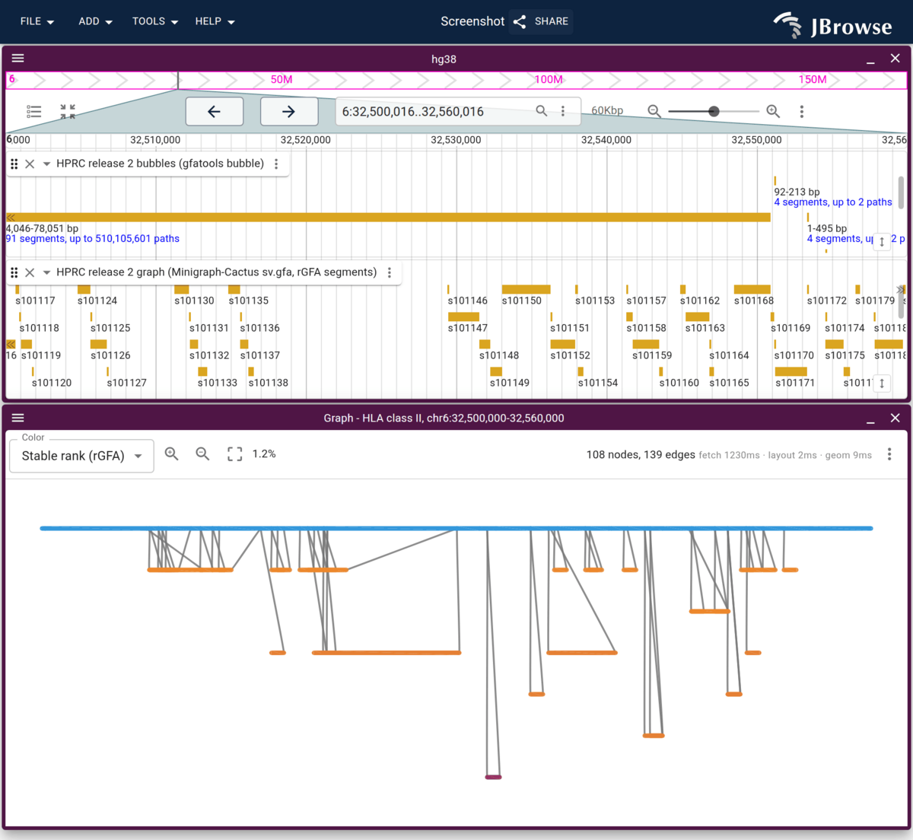
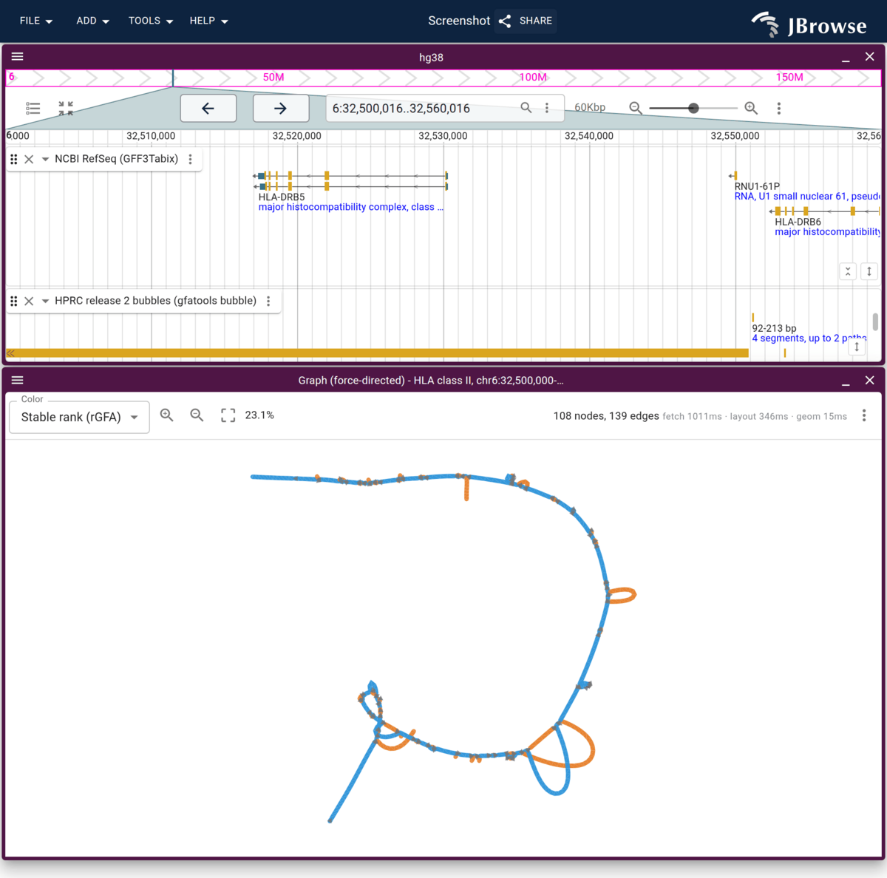

# jbrowse-plugin-graphgenomeviewer

A JBrowse 2 plugin that adds a **GraphGenomeView** for pangenome graphs (GFA /
rGFA), plus a right-click launcher to open the local subgraph around a region
from a linear genome view.

## Screenshots

The HLA class II locus of the HPRC human pangenome, the same subgraph in two
layouts:

| Anchored (rGFA, reference-aligned)     | Force-directed (Bandage)         |
| -------------------------------------- | -------------------------------- |
|  |  |

Left: rank-0 backbone drawn at its GRCh38 offsets with each rank on its own row,
under the bubble and segment feature tracks it was launched from. Right: the same
subgraph laid out by the Bandage force engine, the shape people recognize.

It ships three layouts:

- **Anchored** (rGFA only): x is reference bp, one row per stable rank, read from
  the file so it renders instantly and aligns under a linear view.
- **Sample rows** (rGFA only): x is reference bp, one row per contributing
  assembly.
- **Force-directed**: the graph's shape, computed by the OGDF FMMM engine from
  [Bandage](https://github.com/rrwick/Bandage).

## License (GPL-3.0)

This plugin is **GPL-3.0-or-later**. The force-directed layout is computed by a
WebAssembly build of Bandage's FMMM layout from [OGDF](https://ogdf.github.io/),
and both Bandage and OGDF are GPL-licensed, so this plugin takes the same
license rather than linking around it.

JBrowse itself is unaffected and stays Apache-2.0: this is a separate plugin,
loaded at runtime only by configs that ask for it. The anchored and sample-row
layouts are pure TypeScript and need no external engine.

## Developing

Requires [pnpm](https://pnpm.io/installation).

This plugin depends on `@jbrowse/render-core`, which is not yet published to npm,
so it is consumed via a `link:` to a sibling `jbrowse-components` checkout. Clone
both side by side:

```
~/src/jbrowse-components/     # provides @jbrowse/render-core
~/src/jbrowse-plugin-graphgenomeviewer/
```

Then:

```console
pnpm install
pnpm start        # esbuild watch, serves dist/out.js on :9000 with CORS
```

In another terminal, serve a JBrowse Web that points at `config.json` (its
`plugins` entry already targets `http://localhost:9000/dist/out.js`).

## Building

```console
pnpm build        # minified UMD bundle via esbuild
pnpm typecheck    # tsc, separately — esbuild strips types without checking them
```

This writes two files to `dist/`, and **both must be served from the same
directory**:

- `jbrowse-plugin-graphgenomeviewer.umd.production.min.js` — the plugin (~180kb)
- `bandage-layout.<hash>.js` — the Bandage layout engine (~425kb), named by
  content hash so a redeployed engine is never served from cache

Load the plugin from any JBrowse 2 config:

```json
{
  "plugins": [
    {
      "name": "GraphGenomeView",
      "url": "https://your-host/jbrowse-plugin-graphgenomeviewer.umd.production.min.js"
    }
  ]
}
```

For a fixed deployment you can pin the bundle with subresource integrity, which
JBrowse enforces on load (`integrity` alongside `url`):

```json
{
  "name": "GraphGenomeView",
  "url": "https://your-host/jbrowse-plugin-graphgenomeviewer.umd.production.min.js",
  "integrity": "sha384-<base64 digest>"
}
```

Generate the digest with
`openssl dgst -sha384 -binary FILE | openssl base64 -A`. The engine chunk is
already immutable by content hash, so it needs no separate pin.

The engine is a lazy chunk: it is only fetched the first time someone selects the
force-directed layout, so sessions that use the anchored or sample-row layouts
never download it. Its URL is derived from the plugin's own URL above, which is
why the two files need to sit together — the layout RPC runs in a web worker and
resolves the location from the plugin definition JBrowse passes in. A `layoutUrl`
option on the view overrides that if you need to host the engine elsewhere.

### Rebuilding the engine

`src/bandage/bandage-layout.js` is a committed build artifact, so a normal
`pnpm build` never needs Emscripten. Regenerate it only when the C++ layout
sources change:

```console
pnpm build:wasm   # needs emsdk + a BandageNG checkout (BANDAGE_DIR)
```

It compiles with `-sSINGLE_FILE=1`, embedding the wasm as base64 so the result is
one self-contained ES module that esbuild can copy rather than bundle.

## Testing

```console
pnpm test         # vitest unit tests
pnpm test:watch
pnpm test:wasm    # runs the committed Bandage engine, no deps needed
pnpm test:e2e     # puppeteer, opt-in — see test/README.md
pnpm lint
pnpm typecheck
```

`pnpm test:e2e` drives the force layout through a real JBrowse in a headless
browser. It is gated behind `RUN_E2E=1` until the `graph_viz` jbrowse-components
branch ships; [`test/README.md`](test/README.md) explains why and how to run it.
