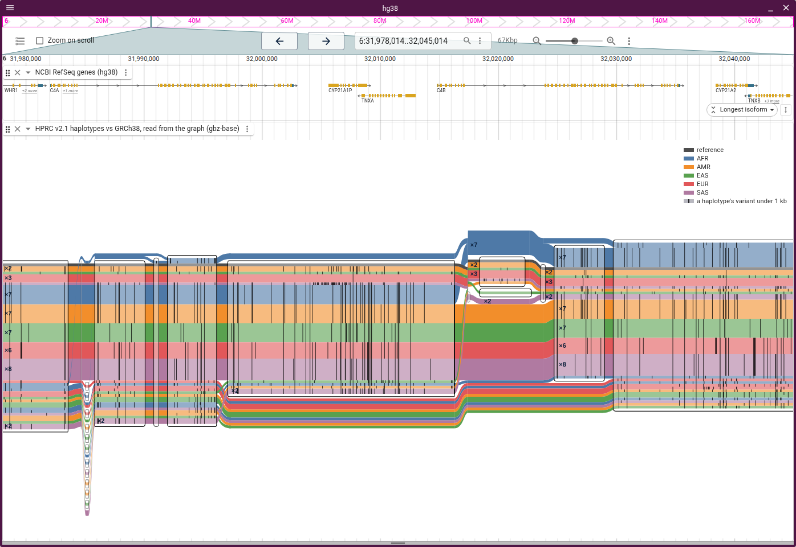

# jbrowse-plugin-graphgenomeviewer

Pangenome graphs in JBrowse 2.

## Do it yourself

Tutorials from the [JBrowse 2 docs](https://jbrowse.org/jb2/docs/tutorials/),
start to finish with commands you can run:

- **[Hosting your own graph](https://jbrowse.org/jb2/docs/tutorials/pangenome_prepare_graph)**
  — start here. One script turns an rGFA or GFA into the indexed files and track
  config, then adds haplotype walks and gbz-base
- [pggb](https://jbrowse.org/jb2/docs/tutorials/pangenome_ecoli) — build a
  five-strain graph from FASTA, index it, project synteny and variants
- [Minigraph-Cactus](https://jbrowse.org/jb2/docs/tutorials/pangenome_cactus) —
  the same from `cactus-pangenome`
- [Cattle](https://jbrowse.org/jb2/docs/tutorials/pangenome_cattle) and
  [mouse](https://jbrowse.org/jb2/docs/tutorials/pangenome_mouse) — open a
  published graph, `vg deconstruct` it, rank its bubbles
- HPRC release 2:
  [graph alleles](https://jbrowse.org/jb2/docs/tutorials/pangenome_hprc),
  [haplotypes against each other](https://jbrowse.org/jb2/docs/tutorials/pangenome_hprc_haplotypes),
  [repeat lengths](https://jbrowse.org/jb2/docs/tutorials/pangenome_hprc_repeats)
- [Graph genome view user guide](https://jbrowse.org/jb2/docs/user_guides/graph_genome_view)

## What data to use

Index the graph into tabix files, or a gbz-base database, so JBrowse reads one
window at a time. A GFA that is small enough opens whole with **Add → Graph
genome view**.

| You have                                                | Make                                                            | With                                                                                                                                                                                                                                 | Adapter                                                          |
| ------------------------------------------------------- | --------------------------------------------------------------- | ------------------------------------------------------------------------------------------------------------------------------------------------------------------------------------------------------------------------------------ | ---------------------------------------------------------------- |
| rGFA (minigraph, Minigraph-Cactus's SV graph)           | `.segs.bed.gz`, `.links.bed.gz`, `.bubbles.bed.gz`, coarse tier | [`build_pangenome_graph.sh`](https://github.com/GMOD/jbrowse-components/blob/main/scripts/build_pangenome_graph.sh), which runs [gfa-to-tabix](https://github.com/GMOD/gfa-to-tabix) and [gfatools](https://github.com/lh3/gfatools) | `RgfaTabixAdapter`                                               |
| Plain GFA (pggb, odgi, vg, base-level Minigraph-Cactus) | the same, plus a snarl VCF for bubbles                          | the script above with `--snarls`; `vg deconstruct` or `pggb -V` writes the VCF                                                                                                                                                       | `RgfaTabixAdapter`                                               |
| GBZ or W-line GFA, for haplotype walks                  | `.walks.bed.gz`, `.nodes.bed.gz`, `.links.bed.gz` per reference | `vg convert -f`, then `gfa-to-tabix --walks`                                                                                                                                                                                         | `WalkTabixSyntenyAdapter`, or `RgfaTabixAdapter` with `walksUri` |
| GBZ, to serve walks from one database                   | `.gbz.db` and `.haplotype-index.db`                             | `vg chains`, `gbz-base construct`, `gbz-haplotype-index`                                                                                                                                                                             | `GbzBaseSyntenyAdapter`                                          |
| Reads                                                   | `.gaf.gz` and its `.tbi`                                        | `vg giraffe -o gaf`, `vg gamsort -G`, `bgzip`, `tabix`                                                                                                                                                                               | `reads` on the gbz-base adapter                                  |

Other tools:

- [`minigraph`](https://github.com/lh3/minigraph) builds an rGFA from
  assemblies, and `minigraph --call` records each assembly's path through it
- [pggb](https://github.com/pangenome/pggb) and
  [Minigraph-Cactus](https://github.com/ComparativeGenomicsToolkit/cactus/blob/master/doc/pangenome.md)
  build graphs from assemblies
- [vg](https://github.com/vgteam/vg) 1.69.0+ converts, deconstructs and aligns
  reads to a GBZ

## As a track of a linear view

A `GraphTrack` cuts the graph for the view's window and redraws it as you pan. A
force-directed track draws a strip of the reference segments at their bp above
the graph, each in its node's colour, so the graph reads against the tracks
above it.

- **LPA's KIV-2 repeat.** The goldenrod outlines on the graph are the gene
  track's LPA exons. The charcoal loops, sequence off the reference, hang inside
  the array the curated VNTR track marks.


- **Each haplotype takes its own loops.** Side by side, one walk per panel:
  HG01960 skips most of GRCh38's loops for the big one, and HG00133 takes both.


- **Copy number off a bar.** Walk rows tile each haplotype by the 5,548 bp
  kringle: GRCh38's six units are the six LPA exon pairs above, and HG00133
  has 27.


- **Allele frequency as a tube map.** A tube per route, as wide as the
  haplotypes taking it, coloured by superpopulation. Over C4's RCCX module, 35
  of 60 haplotypes skip the 6.4 kb HERV-K in C4B, so their C4B is short; thin
  tubes skip a whole 33 kb module, keeping one C4, or add one. Panels split the
  map by sample or a sample table column.



## As its own view

**Add → Graph genome view** opens a whole GFA file. A graph track's **Launch →
Graph genome view** opens the cut on screen, drawn as the track draws it; a
session spec does the same with `loadedTrackId` and `loadedRegion`. Hovering a
node in the view bands its bp in the linear view:


## Features

- Seven layouts: force-directed (Bandage FMMM, or stress in a track), ordered,
  anchored, sample rows, walk rows, and sequenceTubeMap's tube map on its own
  axis or the reference's
- Genes from the session's annotation track, drawn on the graph
- Hovering a callset or MAF row in the same view lifts that haplotype's walk
- Bubbles from `gfatools bubble` or the graph itself, opened level by level
- gbz-base haplotypes as walks: the number of walks through a node as its
  thickness, walks lifted out as metro-map lanes or side by side, a panel per
  walk or a row per sample, each shading from its start to its end
- Tube maps split into a panel per sample, haplotype or sample table column,
  drawn as a tube per route and coloured by a sample table column
- GAF reads in the tube map, with their mismatches, from a gbz-base track
- Figures as SVG: the graph track in the linear view's Export SVG, the graph
  genome view's own Export SVG, or a JSON spec with no browser
  ([docs/figures.md](https://github.com/GMOD/bandage-core/blob/main/docs/figures.md))

## Usage

Needs JBrowse 5.0.0-beta.11 or later.

```json
{
  "plugins": [
    {
      "name": "GraphGenomeView",
      "esmUrl": "https://jbrowse.org/plugins/jbrowse-plugin-graphgenomeviewer/latest/dist/jbrowse-plugin-graphgenomeviewer.esm.js"
    }
  ]
}
```

- **File → Open track** opens an rGFA index (`.segs.bed.gz` from
  [gfa-to-tabix](https://github.com/GMOD/gfa-to-tabix)) or a gbz-base database
  (`.gbz.db`) as a `GraphTrack`. It finds the links and indexes beside the url,
  which a presigned url's signature doesn't cover; spell out each location in a
  config instead
- A hand-written track needs only the adapter:

```json
{
  "type": "GraphTrack",
  "trackId": "hprc_graph",
  "name": "HPRC release 2 graph",
  "assemblyNames": ["hg38"],
  "adapter": {
    "type": "RgfaTabixAdapter",
    "uri": "https://example.com/hprc",
    "coarse": {
      "uri": "https://example.com/hprc.tier10000",
      "aboveBpPerPx": 1000
    }
  }
}
```

- The track menu picks layout, colour and highlighted haplotypes, and switches
  to the segments lane or, for gbz-base and walk-indexed graphs, the haplotype
  lanes
- Cuts the window plus a window each side, up to 5 Mb; past `aboveBpPerPx`, the
  `coarse` tier (`build_bubble_tier.sh` in jbrowse-components)
- Past the cut (5 Mb, or a gbz-base adapter's `nodeLimit`) the track asks you to
  zoom in. For a population view of a wide window, add the graph's VCF as a
  variant track (`vg deconstruct` makes one from a GBZ)
- gbz-base swaps in `{ "type": "GbzBaseSyntenyAdapter", "uri": "….gbz.db" }`; an
  `hg38` or `hs1` track finds the graph's GRCh38 or CHM13 reference sample, and
  `assemblyNameToPanSN` covers other names. A haplotype's lane draws on the
  assembly aliased by its PanSN name (`HG002#1`) with no map entry
- A walk-indexed graph (`gfa-to-tabix --walks`) swaps in
  `{ "type": "WalkTabixSyntenyAdapter", "walksUri": "….GRCh38", "assemblyNames": ["hg38"] }`
  and draws the same haplotype lanes from the walk files, with no database
- `"reads": "….gaf.gz"` on the gbz-base adapter draws GAF reads in the tube map
  layouts, fetched through its tabix index;
  [docs/layouts.md](docs/layouts.md#reads) has the config and how to make one

## Docs

- [docs/layouts.md](docs/layouts.md) — layouts, bubbles, walks, genes, loci
- [docs/developing.md](docs/developing.md) — building, testing, `host-compat`

## See also

We made r package ports of this functionality here

- [ggtubemap](https://github.com/gmod/ggtubemap) - R port of the tubemap concept
- [ggbandage](https://github.com/gmod/ggbandage) - R port of the bandage layout
- [BandageJS](https://github.com/cmdcolin/BandageJS) - Standalone 'app' outside
  of JBrowse with bandage layouts
- [JBrowsed 2 tutorials](https://jbrowse.org/jb2/docs/tutorials/) - Includes
  several pangenome tutorials using this plugin

## License

GPL-3.0-or-later (this module is based on work from Bandage and ODGF graph
drawing algorithms which are both GPL).
