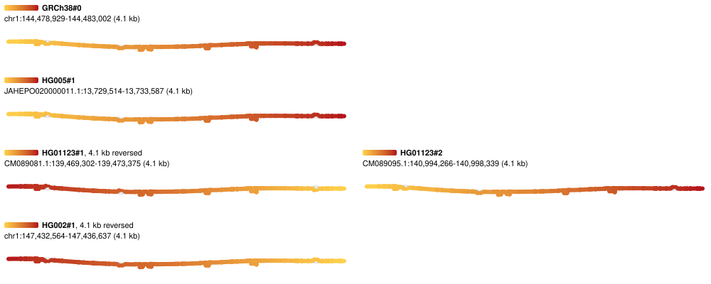

# Figures from a spec

`bandage-figure`, in
[@jbrowse/bandage-core](https://www.npmjs.com/package/@jbrowse/bandage-core),
draws a pangenome graph to an SVG from a JSON spec, with no browser. It runs the
same layout engine, geometry and renderer the plugin and BandageJS draw the
screen with, so a figure matches what the viewer showed, and the same spec makes
the same figure again: two runs of one spec write identical files.

```console
npx -p @jbrowse/bandage-core bandage-figure figures/1q21_sample.json -o 1q21.svg
```

[figures/1q21_sample.json](../figures/1q21_sample.json) cuts the 1q21.1
inversion from the HPRC release 2 graph, lifts five walks and puts each sample's
haplotypes in a row:

```json
{
  "gbz": {
    "db": "hprc",
    "region": "chr1:144,480,000-144,482,000",
    "haplotypes": ["HG002#1", "HG005#1", "HG01123#1", "HG01123#2"]
  },
  "layout": "force",
  "walks": [
    "GRCh38#0#chr1",
    "HG005#1#JAHEPO020000011.1",
    "HG01123#1#CM089081.1",
    "HG01123#2#CM089095.1",
    "HG002#1#chr1"
  ],
  "facet": "sample",
  "width": 1000
}
```



Each panel shades its walk yellow where it starts and red where it ends, so a
walk that runs red to yellow crosses the region the other way from GRCh38.
HG01123's row holds both orientations.

## The spec

| Field                      | What it sets                                                                                                            |
| -------------------------- | ----------------------------------------------------------------------------------------------------------------------- |
| `gfa`                      | a GFA file (plain or gzipped) or url; a relative path is read from beside the spec                                      |
| `gbz`                      | a window cut from a gbz-base database: `db` (a file, url or `hprc`), `index`, `region`, `haplotypes`, `referenceSample` |
| `region`                   | the reference window a `gfa` was cut for, which the anchored layouts span                                               |
| `referencePath`            | the path a walk graph is drawn along                                                                                    |
| `layout`                   | a layout mode: `force` (the default), `auto`, `ordered` or `samplerows`                                                 |
| `quality`, `bubbleSpread`  | the force-directed engine's settings                                                                                    |
| `walks`                    | the walks to lift: names, or `{ "walk", "color": { "field", "scheme" } }` layers                                        |
| `facet`                    | `none`, `walk` (a panel per walk) or `sample` (a row per sample, a column per haplotype)                                |
| `columns`                  | how many panels go across by walk; unset takes whichever count draws each largest                                       |
| `width`, `height`          | the figure's width, and the most height it may take                                                                     |
| `colorScheme`, `nodeWidth` | as the view's Color menu and node width setting                                                                         |
| `showDeletionEdges`        | draw the edges that skip reference sequence                                                                             |

Every SVG keeps its spec in its `<metadata>`, so a figure found later says how
it was made.

In the plugin, **Export SVG** in the view's menu saves the drawing through the
same renderer. In BandageJS, **Export SVG** does the same and **Copy figure
spec** gives the spec for what is on screen, to make the figure again from a
script.

`node scripts/render-figures.mjs` renders every spec in [figures/](../figures)
to `img/figure_<name>.svg`.
