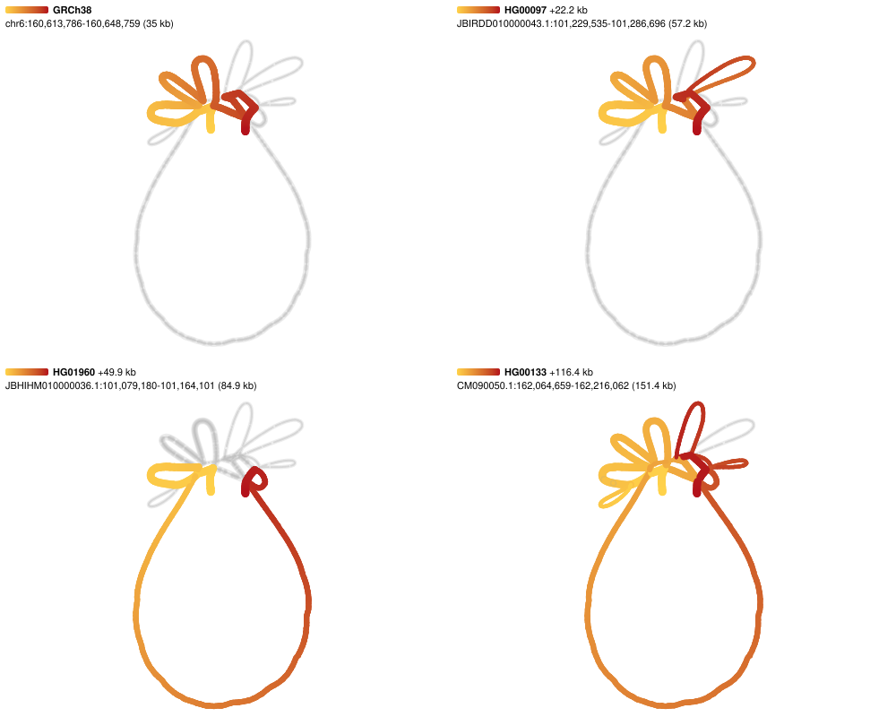

# Figures from a spec

`bandage-figure`, in
[@jbrowse/bandage-core](https://www.npmjs.com/package/@jbrowse/bandage-core),
draws a pangenome graph to an SVG from a JSON spec, with no browser. It runs the
same layout engine, geometry and renderer the plugin and BandageJS draw the
screen with, so a figure matches what the viewer showed, and the same spec makes
the same figure again: two runs of one spec write identical files.

```console
npx -p @jbrowse/bandage-core bandage-figure figures/kiv2_walks.json -o kiv2.svg
```

[figures/kiv2_walks.json](../figures/kiv2_walks.json) cuts LPA's KIV-2 repeat
array from the HPRC release 2 graph and lifts four walks through it, a panel
each:

```json
{
  "gbz": {
    "db": "hprc",
    "region": "chr6:160,614,798-160,647,758",
    "haplotypes": ["HG00097#1", "HG01960#1", "HG00133#1"]
  },
  "layout": "force",
  "walks": [
    "GRCh38#0#chr6",
    "HG00097#1#JBIRDD010000043.1",
    "HG01960#1#JBHIHM010000036.1",
    "HG00133#1#CM090050.1"
  ],
  "facet": "walk",
  "width": 1000,
  "columns": 2
}
```



Each panel shades its walk yellow where it starts and red where it ends, on the
same layout, so the walks compare by the loops they take. GRCh38 takes the small
ones; HG00097 adds one (+22.2 kb); HG01960 skips most of GRCh38's for the big
one (+49.9 kb); HG00133 takes both (+116.4 kb).

## The spec

| Field                      | What it sets                                                                                                                                                  |
| -------------------------- | ------------------------------------------------------------------------------------------------------------------------------------------------------------- |
| `gfa`                      | a GFA file (plain or gzipped) or url; a relative path is read from beside the spec                                                                            |
| `gbz`                      | a window cut from a gbz-base database: `db` (a file, url or `hprc`), `index`, `region`, `haplotypes`, `referenceSample`, and a track's `context` and `snarls` |
| `genes`                    | a GFF3 or BED `file` or url, read by range through its `index` (`.tbi` or `.csi`) where there is one: the genes on the backbone, outlined and named           |
| `genes.refNames`           | the file's name for a contig it names other than as the graph does, `{ "chr6": "NC_000006.12" }`; `6` for `chr6` needs none                                   |
| `region`                   | the reference window a `gfa` was cut for, which the anchored layouts span                                                                                     |
| `referencePath`            | the path a walk graph is drawn along                                                                                                                          |
| `layout`                   | a layout mode: `force` (the default), `auto`, `ordered` or `samplerows`                                                                                       |
| `quality`, `bubbleSpread`  | the force-directed engine's settings                                                                                                                          |
| `walks`                    | the walks to lift: names, or `{ "walk", "color": { "field", "scheme" } }` layers                                                                              |
| `facet`                    | `none`, `walk` (a panel per walk) or `sample` (a row per sample, a column per haplotype)                                                                      |
| `columns`                  | how many panels go across by walk; unset takes whichever count draws each largest                                                                             |
| `width`, `height`          | the figure's width, and the most height it may take                                                                                                           |
| `colorScheme`, `nodeWidth` | as the view's Color menu and node width setting                                                                                                               |
| `showDeletionEdges`        | draw the edges that skip reference sequence                                                                                                                   |

Every SVG keeps its spec in its `<metadata>` beside the version that drew it,
such as `@jbrowse/bandage-core@4.0.25`, so a figure found later says how it was
made and with what;
`npx -p @jbrowse/bandage-core@4.0.25 bandage-figure spec.json` makes it again.

In the plugin and BandageJS, **Export SVG** saves the drawing through the same
renderer, and **Copy figure spec** gives the spec for what is on screen, to make
the figure again from a script. The plugin writes one for a graph cut from a
gbz-base track or read from a GFA url, with the genes of a GFF3 tabix track.

`node scripts/render-figures.mjs` renders every spec in [figures/](../figures)
to `img/figure_<name>.svg`.
