# Layout experiments on HPRC loci

Measured 2026-09-13 on the six loci the HPRC tutorials use, cut from the hosted
release 2.1 rGFA index exactly as the view cuts them. The question was why the
two shipped layouts read badly on a pangenome window and what would read better.
Four changes came out of it, in the order they are worth building:

1. **Orient the force layout to the reference.** A rigid rotation after FMMM,
   fitted on the backbone. JS only, no engine change. Every window then reads
   left to right in the same direction as the linear view above it.
2. **Seed FMMM from reference coordinates.** Backbone end to end along x,
   alleles at their anchors, `KeepPositions`, and no component rotation. This
   removes the curl that turns every long reference run into a C or a spiral, at
   the same cost as random placement. About 40 lines of C++ in the engine.
3. **A reference-ordered layered layout.** The tube map's skeleton without its
   lanes: x is reference order, node width is log bp, y is a lane. 2 ms on 279
   nodes. Bubbles read as lenses, a SNP allele gets the same room as a 10 kb
   segment, and the drawing scrolls instead of shrinking. This is the candidate
   to replace **Anchored** as the default for an rGFA cut.
4. **Haplotype lanes.** For path GFAs with many walks, port the sequence tube
   map's ordering and lane passes and give the renderer per-node lane packing.
   The largest change and the one that makes a GBZ cut of eight haplotypes a
   picture rather than a rope.

Everything below uses the view's **Reference position** colour scheme: rank-0
segments take a hue from red to magenta across the window, exactly as the rGFA
segments track paints them in the linear view, and off-reference segments are
charcoal. That is the one colouring in which a reader can find a graph node in
the linear view and back, so it is the one every comparison here is drawn in.

## The test cases

| Locus        | Window                         | Nodes | Edges | What the graph holds                                                                     |
| ------------ | ------------------------------ | ----: | ----: | ---------------------------------------------------------------------------------------- |
| LPA KIV-2    | `chr6:160,525,000-160,655,000` |    58 |    81 | The kringle repeat: each loop is a copy, haplotypes differ in how many they walk         |
| MHC class II | `chr6:32,510,000-32,600,000`   |   279 |   370 | The DRB haplotypes: a 12 kb reference stretch many haplotypes replace, dozens of alleles |
| AMY1         | `chr1:103,690,000-103,780,000` |    42 |    54 | The amylase copy-number locus; the cut arrives in several pieces                         |
| C4           | `chr6:31,980,000-32,050,000`   |    34 |    41 | One bubble spanning the C4A/C4B duplication                                              |
| CFH          | `chr1:196,640,000-196,900,000` |    44 |    60 | The CFHR3/CFHR1 deletion as a bare edge skipping 84 kb of reference                      |
| KIR          | `chr19:54,750,000-54,840,000`  |   154 |   199 | The KIR cluster, the densest of the six                                                  |

The cuts come from `https://jbrowse.org/demos/hprc/hprc-v2.1-mc-grch38` with the
adapter's one-hop rule (`subgraphContext: 1`, the view's default), so the KIV-2
cut is the same 58 nodes and 81 edges the tutorial figure shows.
`scripts/layout-lab/cut-hprc.ts` reproduces them.

These six are also the demonstration set for README screenshots once a layout
lands: each has a tutorial figure at
`jbrowse-components/website/static/img/pangenome/` showing the linear view above
the graph, so a before/after pair needs no new locus.

## Why the shipped layouts look the way they do

The force mode hands OGDF FMMM one chain of nodes per segment (one per 20 drawn
units, 5-unit edges between segments), places them at random, runs one FMMM per
connected component, rotates each component through 50 angles to minimise its
bounding box against a 4:3 page ratio, and packs the components. That is
upstream Bandage's recipe and three of its properties fight a pangenome window:

- A long chain under FMMM's repulsion buckles, so the reference is a C or a
  spiral and the two arms of a bubble ride the curve.
- The rotation optimises area, not reading direction, so the reference runs
  diagonally in one window and top to bottom in the next.
- Node length is linear in bp, so 1-50 bp alleles clamp to the 5-unit floor.

The anchored mode is the opposite extreme. x is reference bp, so an allele
occupies the bp it replaces and a SNP is a sliver under a 60 kb line; y is one
row per rank, which on HPRC means nothing biological. Bubbles collapse onto the
axis and the drawing reads as a track.

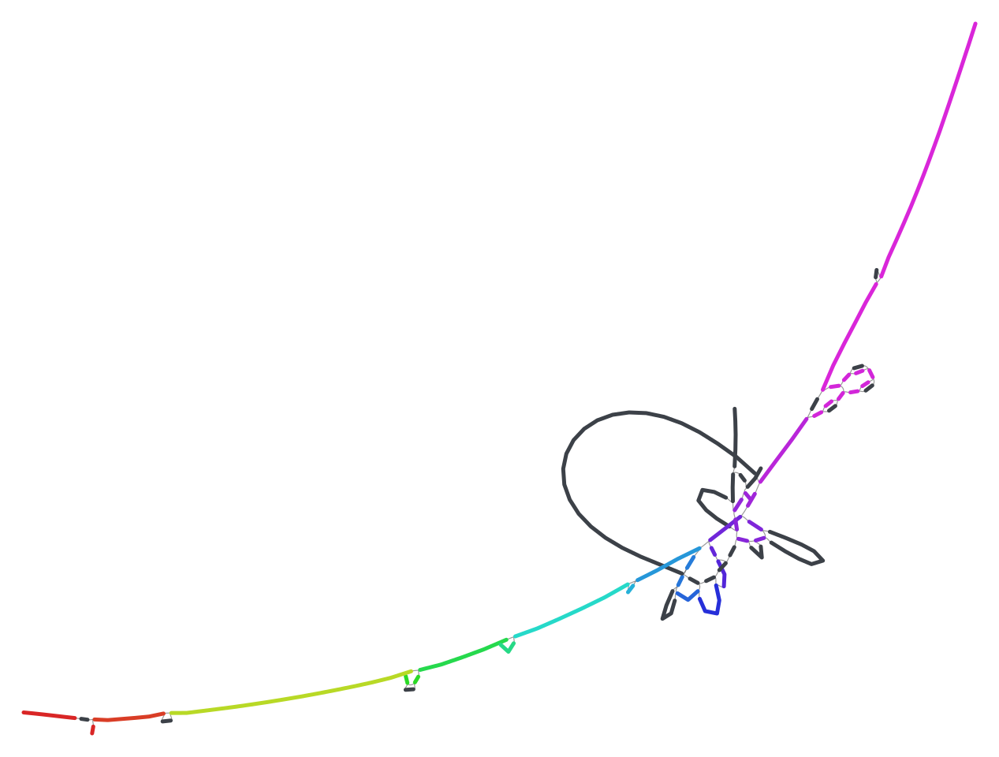

_KIV-2 as the view draws it today. The reference runs diagonally; the kringle
loops hang off its middle._

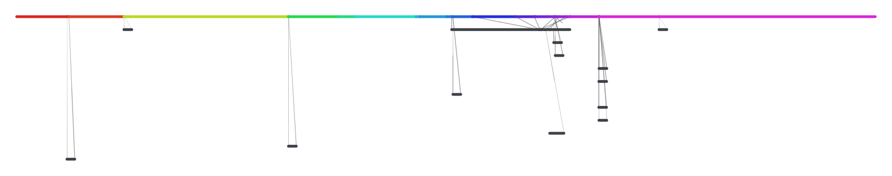

_The same cut in the anchored layout._

## Experiment 1: orient to the reference

Fit the rotation that maps backbone node midpoints onto their reference
coordinate (a one-dimensional orthogonal Procrustes fit, weighted by segment
length), then reflect so the off-reference mass sits below the axis. The
drawing's shape is untouched; only its frame moves.

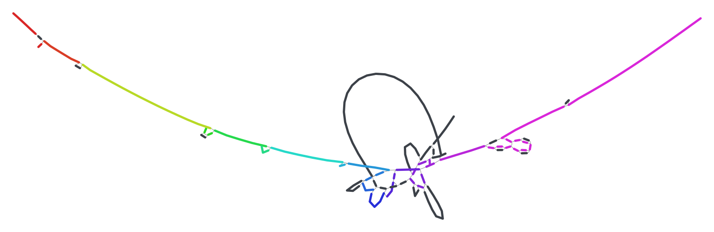

_KIV-2 oriented. Red is now on the left in every window, which is the one thing
the linear view above it can promise too._

The fit does nothing for curl: a rope has no principal axis, so a window whose
backbone curls into a C comes out as a C, merely upright.

## Experiment 2: seed FMMM from the reference

FMMM accepts initial positions through `InitialPlacementForces::KeepPositions`,
which the engine already uses for `linearLayout`, seeded from node **name**
order. Seeding from what the graph states instead: backbone segments end to end
along x at their drawn length, each allele at the x of its anchor with a y
offset by BFS depth, then FMMM with the component rotation switched off and the
orientation fit applied.

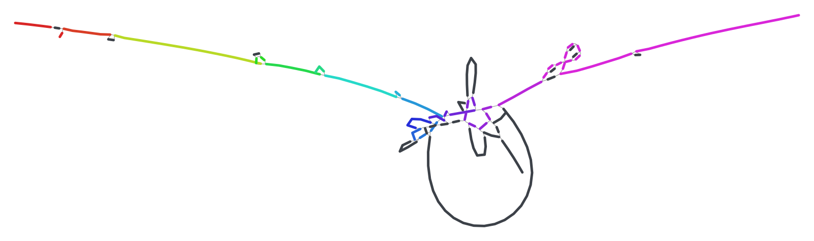

_KIV-2 seeded. The reference is a gentle arc left to right; each kringle copy is
a loop hanging under the position it belongs to._

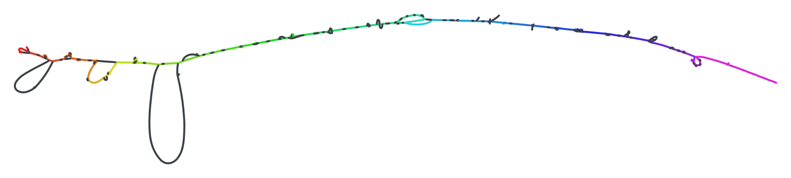

_MHC class II, 279 nodes, seeded. The shipped layout of this cut is an L._

The cost is the same as random placement. In one native binary, min of three
runs, seeded against random: KIV-2 39 against 37 ms, MHC class II 112 against
108 ms, KIR 77 against 78 ms. (An earlier draft called it faster by comparing
the native seeded run to the wasm random one; the review caught that.)

How much of the seed FMMM keeps is less than it looks. OGDF applies the initial
placement only at the coarsest level of its multilevel scheme and re-derives
every finer level from the coarse solution with jitter, and its `minGraphSize`
is 50 OGDF nodes, so every real cut is coarsened. What survives is the coarse
shape of the backbone, which is exactly the property wanted; the allele y
offsets are discarded, which is why the seed function can be simpler than the
lab's and why the drawings wave. `singleLevel` would honour every seed exactly
and is the cheaper cure for the waviness than more iterations. Untested.

Two limits stay. Above roughly 300 nodes on screen the drawing is a rope
whatever the seed, because node thickness is constant in pixels and zoom-to-fit
gives each node under 3 px (`agent-docs/GRAPH_SCALE_AND_LOD.md`). And a window
whose alleles close a large cycle, a haplotype bypassing most of the window,
still draws the cycle.

The engine change, with what the review added:

- `bindings.cpp` reads an optional `x`/`y` per node and `addToOgdfGraph` takes
  them as the chain's start, the code path `linearLayout` already has.
- The rotation is cut in two places: `stepsForRotatingComponents(0)` on the FMMM
  instance and skipping the rotation in `reassembleDrawings`, while keeping its
  MAAR packing, since a cut can arrive in several components (KIR does).
- Seeds come from the same `LayoutScaling` the model already hands the engine,
  not from bp: under the `compress` bubble spread a node's `length` crosses the
  RPC as drawn units times 1000 with a matching `nodeLengthPerMegabase`, so a
  seed computed from bp would misplace every chain.
- `forceLayoutKey` gains the reference path. Today it omits it because the path
  never reaches the engine; with seeds it does, and without the key a
  re-anchored graph would be served a stale layout.
- `linearLayout` is superseded for anchored graphs and its two remaining
  readers, the settings menu and the arrow threshold in `GeometryBuilder`, need
  a decision. `LayoutMode.run` has no channel for seeds, so the mode interface
  grows one.
- `layout-digest.mjs` gains the seeded cases and every force figure of an
  anchored graph regenerates, deliberately.

The native driver reproduces the engine's graph construction exactly (chains,
lengths, self-loop rule) but lays components in a row rather than packing them,
so a multi-component cut differs in component placement only.

## Experiment 3: a reference-ordered layered layout

Every node gets an integer layer; x is cumulative layer width; y is a lane.
Backbone nodes take increasing layers in reference order. Every edge is directed
from lower to higher reference order, so the graph is acyclic by construction
and no cycle-removal heuristic can misplace the reference. Off-reference nodes
take the longest-path layer between their anchors, then slide right to centre in
their bubble. Node width is `10 + 8 * log2(bp)`, the tube map's compressed rule.
y is a left-to-right barycenter sweep with the backbone pinned at 0 and each
allele taking the nearest free lane above or below. Ninety lines of JS,
`scripts/layout-lab/ordered.mjs`.

_KIV-2 ordered, drawn 4,800 px wide. Each kringle copy is a lens on the
reference line; the dashed reference-to-reference skips are the bare edges the
view already labels as deletions._

_MHC class II ordered. 279 nodes fit one scrollable strip, every allele
visible._

This keeps what the anchored layout was for, a left-to-right reference with x
monotone in reference order, but x is **order**, not bp, so a SNP allele gets
the same drawn room as a 3 kb segment beside it and a bubble is a lens rather
than a bar under a line. It gives up lining up under a linear view column for
column. The row layouts stay for the figures that need that.

Two things the lab's pictures understate. The lab renderer draws every link
straight, so a deletion edge runs along the reference line and hides; the view
bows a deletion arc around the backbone it bypasses (`deletionEdges.ts`), and on
this layout the bypassed run sits between the arc's endpoints, so the arcs come
out better than under random FMMM. And the log widths give up the bp
comparability the arc's size relies on, so the arc reads as topology, not as a
length. The review also found alleles landing on the reference lane in layers
with no backbone node; the lane is now reserved everywhere.

OGDF's own `SugiyamaLayout` was tried for the same job. It draws bubbles well
but does not know rank 0, so its cycle removal wraps the backbone into two rows
on the HLA cut. Compiled to wasm, the lab driver grows from 307 KB to 1.88 MB
with Sugiyama, both raw wasm; the shipped engine embeds its wasm as base64, so
the shipped cost would be around 2.6 MB. Most of that is `OptimalRanking`'s
COIN-OR LP solver, and a longest-path-only build would be far smaller. The JS
layout needs none of it.

## Experiment 4: haplotype lanes

The same windows through sequenceTubeMapModern's `tubemap.ts`, run headless
under jsdom. Its ordering is a path-anchored version of experiment 3. What it
adds is per-node lane packing: a node is as tall as the haplotypes through it, a
track keeps its lane where it can, and a haplotype that skips a node runs past
it as a horizontal band. No layout that emits one polyline per node can express
that, and the view's `drawPaths` ribbons, which offset every path by a constant,
draw 44 walks as a rainbow rope.

The costs are real and documented in that repo: cost tracks node visits, not
nodes; width grows superlinearly with the window; every haplotype is drawn. On
the hosted KIV-2 eight-haplotype GBZ cut (15,808 nodes, 9 walks) the tube map
laid out in 3.3 s and produced a 226,000 px wide strip. The port is
`generateNodeOrder` (about 150 lines) and `generateLaneAssignment` with
`generateSingleLaneAssignment` (about 450 lines), plus lane geometry in
`LayoutResult` and a lane-band pass in `GeometryBuilder`. The license is MIT.

## Does the picture mean anything?

Take the KIV-2 window and ask what a geneticist wants from it. The kringle IV
type 2 array is a tandem repeat of a 5.5 kb unit whose copy number varies from
about 6 to more than 40 and sets LPA expression and cardiovascular risk. The
questions are: how many copies does each haplotype carry, how does that compare
with GRCh38, and what else varies in the window. Now look at what any node
layout of the 58-node cut answers. The seeded force layout shows a rainbow line
with a charcoal knot at 160.62 Mb; the knot has loops, and each loop is a
segment carrying extra copies, but nothing says how many copies, for whom, or
how often. Every allele is the same charcoal whether one haplotype or four
hundred carry it. A 68 kb allele dominates the picture because node length is
proportional to bp, while a common 1 bp variant is a speck. The layout changes
above make the drawing tidier; they do not make it answer the question. Neither
does the anchored layout, and neither does Bandage, whose whole vocabulary is
node length, depth and colour.

Three devices, each built from data the plugin already has or can fetch, do
answer it. All three were prototyped on the same cuts.

### A variant map from the bubble decomposition

`gfatools bubble` is already hosted beside the segments
(`hprc-v2.1-mc-grch38.bubbles.bed.gz`, the source of the bubbles track) and
states, per bubble, the reference interval, the member segments, the number of
distinct routes, an inversion flag and the shortest and longest route in bp.
From those numbers alone each bubble classifies as SNP, substitution, insertion,
deletion, inversion, repeat array or superbubble, with its size. Drawn as one
glyph per bubble on the reference line, height by allele length, a window reads
as a sentence rather than a topology:

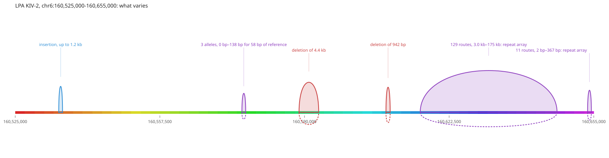

_KIV-2: an insertion of up to 1.2 kb, a 3-allele site, a 4.4 kb and a 942 bp
deletion, the array with 129 distinct routes from 3 kb to 175 kb, and an
11-allele microsatellite. The 58-node graph says all of this and none of it
legibly._

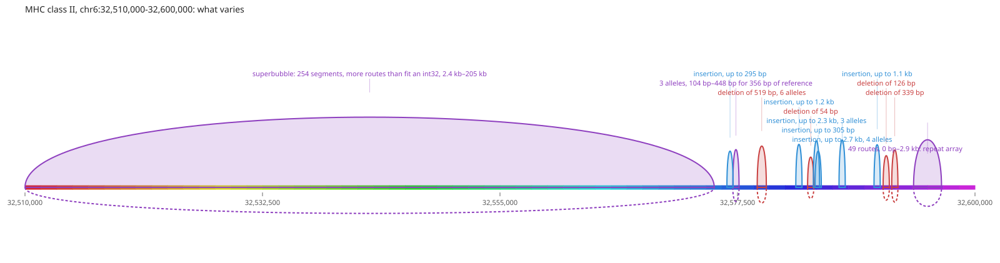

_MHC class II: one superbubble of 254 segments covering the DRB haplotype block,
whose distinct-route count overflows a 32-bit integer, then a run of indels and
a 49-route complex site. The superbubble is where a reader would pop the graph
open; the indels need no graph at all._

The route count is combinatorial, not a haplotype count, and says so when it
saturates. AMY1's superbubble carries the inversion flag, C4's two bubbles are
the RCCX modules (66 kb, 21 routes and 39 kb, 10 routes), CFH's 361-route bubble
is the CFHR3/CFHR1 region with a 0 bp route, the deletion.
`scripts/layout-lab/bubbles.mjs` draws these from the hosted file in a second.

### Pop one bubble

PangyPlot's central device is this: the graph opens as bubble chains and a click
pops one bubble down to its segments. The hosted bubble rows carry the member
ids, so popping is a cut, not a layout problem. The KIV-2 array's 29 segments in
the layered layout and in seeded FMMM:

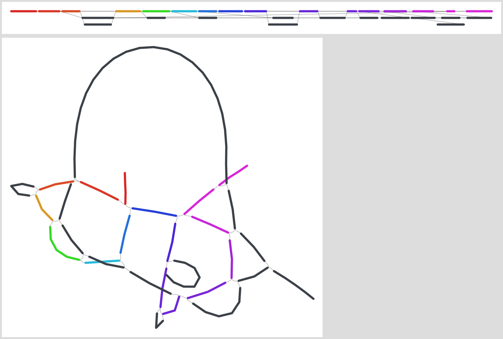

_Top: the array bubble alone, layered. Seven alleles hang off a reference of
fourteen segments and every edge is readable. Bottom: the same 29 nodes under
FMMM, already a tangle. Below about thirty nodes the force layout has nothing
left to offer over a layered one._

### How much each haplotype carries

The base-level Minigraph-Cactus graph does not revisit reference nodes through a
repeat array, so copy number is not a visit count; it is the sequence a walk
spends between the bubble's flanking reference nodes. On the hosted
eight-haplotype KIV-2 GBZ cut:

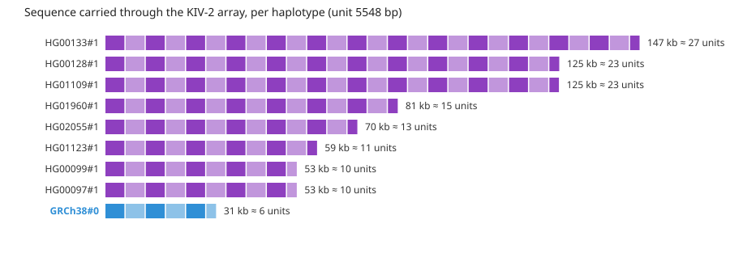

_GRCh38 carries 31 kb through the array, about six units; HG00133 carries 147
kb, about 27. This one chart is the biology of the locus, and no node layout can
show it. It needs walks, which the GBZ route supplies and the rGFA cut does
not._

The same walks give carriage per node: of the cut's 15,808 nodes, 1,259 are
private to one haplotype and 213 are shared by all nine. Bandage draws node
width from depth for exactly this reason, and the tube map draws ribbon width
from path frequency; the plugin's converter already stores traversals as
`depth`, so allele thickness by carriage is a colour-scheme-sized change once
the cut carries paths.

### What the other viewers do, and do not

- **PangyPlot** (`~/src/vendor/pangyplot`): bubble chains from BubbleGun as the
  primary abstraction, progressive popping, a two-tier level of detail from a
  chromosome skeleton to force-laid bubbles, a reference spine mapping bp to
  layout and back, gene pins along it, haplotype path tracing from a GBWT, and
  colour by segment count, length, on/off reference or position. No variant
  typing, no allele frequency.
- **BandageNG**: node width by depth, nine colour schemes including CSV and tag
  columns, stacked labels, path and BLAST-hit highlighting with fractional ends,
  BED overlays, and scope around paths or walks. Everything is a property of a
  node; nothing is a property of a variant.
- **sequenceTubeMap**: haplotype ribbons with width by frequency, BED features
  painted on tracks, a Sankey view with band width by read count, base-level
  mismatch glyphs, a bp ruler.

None types a bubble as SNP, indel, SV or repeat with its size. None encodes how
many haplotypes take each branch of a bubble. None shows per-haplotype sequence
through a repeat. Those three are the additions that would move the view from
showing topology to showing variation, and each has its data source: bubble rows
for typing, walks for frequency and carried length, both already hosted.

### What to build, revised

The layout work above still stands as the base layer, but the order of value is
now:

1. **A bubble layer on the reference axis**, drawn from the bubbles index, with
   the type and size label as the primary text and the node graph inside a
   bubble shown on click, laid out layered. The rGFA track already fetches the
   rows; the view needs the glyph, the classifier and the pop.
2. **Carriage as thickness and frequency as colour** for any cut with paths,
   which today means the GBZ route, and a bubble-level "N of M haplotypes take
   this branch" from the same walks.
3. **A per-haplotype panel for a selected bubble**: sequence carried, copies at
   a stated unit, presence or absence, sortable, the genotype-matrix surface
   `HAPLOTYPE_WALKS_VISION.md` already argued for.
4. **Gene pins along the backbone** from the session's annotation track, so a
   bubble reads as "inside HLA-DRB5" rather than at a coordinate.
5. Then the layout changes: orientation, seeds, the layered mode for whatever is
   popped open.

## Shipped the same day

Three of the four are in the plugin, two as layout modes and one inside the
force layout:

- **Variant map** (`layoutMode: 'variants'`, `layout/variantMapLayout.ts`,
  `components/BubbleOverlay.tsx`, `bubbles/classifyBubble.ts`). The layout
  places only the backbone at its bp; the overlay reads the bubble index beside
  the rGFA prefix (`<prefix>.bubbles.bed.gz`) through the existing
  `MinigraphBubbleAdapter` over the cut window and draws one glyph per bubble,
  typed and sized by `classifyBubble`. Clicking a glyph runs `popBubble`, which
  cuts the bubble's segments out of the loaded graph and lays them out ordered;
  `unpopBubble` restores the window. The pane reserves height for the glyphs.
- **Ordered** (`layoutMode: 'ordered'`, `layout/orderedLayout.ts`), the port of
  the layered prototype with the reserved reference lane.
- **The seeded engine.** For a graph with a backbone, `force` now sends every
  node an `x`/`y` from `layout/referenceSeeds.ts` with the engine option
  `rotateComponents: false`, and `layout/orientToReference.ts` turns the result
  so the reference reads left to right. `forceLayoutKey` carries the reference
  path, since the seeds depend on it. `linearLayout` is untouched.

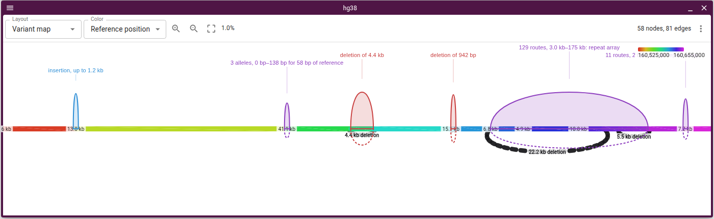

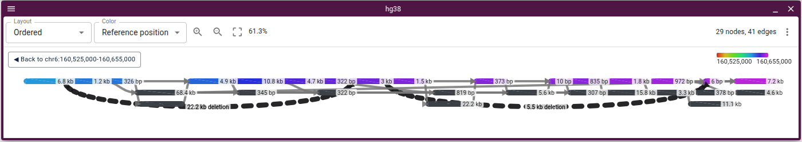

Both screenshots are the real view over the hosted HPRC release 2.1 index, cut
by the view itself. Not yet built: carriage as thickness, the per-haplotype
panel, and gene pins.

## Bubbles from the graph itself

The variant map needed an index next to the rGFA. Three kinds of graph have
none: a GBZ cut (base-level integer ids, W lines, no `gfatools bubble` rows), a
pggb or odgi GFA loaded as a file, and the subgraph a popped bubble shows. The
`gbz-base` reader does not help here: the database stores the top-level chain
decomposition only as `next` pointers on boundary node records, used to extract
`contained` or `overlapping` snarls, with no rows, no reference intervals and no
nesting (`~/src/gmod/gbz-base-js/src/subgraph.ts`, `860-932`).

The layered order already carries the decomposition. A backbone node alone in a
layer that no edge jumps over is a bubble boundary, the window's first and last
backbone nodes are boundaries whatever their layers hold, and what lies between
two consecutive boundaries is a bubble. Route statistics come from the walks
when the graph has them (bp between the two boundary nodes along each walk,
distinct step sequences as routes), otherwise from a DP over the layered DAG. A
bubble whose reference chain is broken inside the cut, a flank the hop reached
from an allele, is marked partial. `bubbles/bubblesFromGraph.ts` is the port,
and the view's `bubbles` fall back to it wherever no index rows arrived.
Measured with the shipped code:

| graph                                |  nodes | bubbles |   time | against the index                                                                                                     |
| ------------------------------------ | -----: | ------: | -----: | --------------------------------------------------------------------------------------------------------------------- |
| MHC class II rGFA cut                |    279 |      11 |   3 ms | the same deletions, insertions, the 6- and 8-allele sites and the 49-route repeat; the DRB superbubble marked partial |
| KIV-2 rGFA cut                       |     58 |       7 |   2 ms | the six rows, with the array and the microsatellite beside it merged because an edge spans their shared anchor        |
| KIV-2 GBZ cut, eight haplotypes      | 15,808 |      21 | 128 ms | no index exists; 20 SNPs and small indels in the flank, the array as one bubble of 9 routes from 32 kb to 148 kb      |
| E. coli pggb window, P lines         |     54 |      14 |   2 ms | no index exists                                                                                                       |
| 1q21.1 inversion superbubble, popped |    221 |       1 |   3 ms | an inversion reverses the reference order inside it, so every interior backbone node is spanned: one bubble           |

The GBZ result is checked by conservation: for every haplotype, the sum over
bubbles of walk bp minus reference span equals the walk's excess over the
reference, 0 for GRCh38, 22.2 kb for HG00097, 116.4 kb for HG00133. Before the
window ends counted as boundaries the array fell into no bubble at all and those
sums were zero; `bubblesFromGraph.test.ts` carries that check on a synthetic
graph.

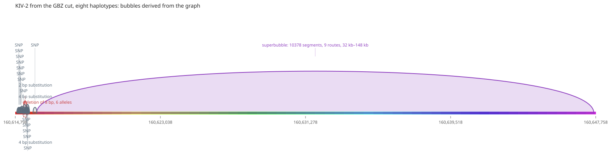

_The eight-haplotype GBZ cut with no index: the array as one bubble, its route
lengths the haplotypes' own._

Two limits. The decomposition is chain-level: nested bubbles and an inverted
stretch come out as one bubble each, which is what the chain of a snarl tree
looks like before descending, and popping is how to descend. And the strand a
path first visits a node with is not an inversion (a pggb path walking the
window backwards made eleven SNPs read as inversions in a first draft), so
derived bubbles do not claim one.

This is what makes the variant map a property of any anchored graph rather than
of one hosted file, and what makes popping recursive: the popped subgraph gets
its own bubbles, and `popStack` in the model holds every level a reader
descended through, so each closes back to the one above it.

### The GBZ route in the view, and what its cut keeps

The view over the hosted gbz-base database, with the eight tutorial lanes
selected, draws the same 20 flank sites at KIV-2 but reads the array as two
bubbles of 4 and 1 routes, 22 kb and 5.5 kb, where the 200 kb-context lab cut
above reads one bubble of 9 routes up to 148 kb. The adapter's cut is the
reference walk plus 1 kb of `context`, and each haplotype's walk comes back as
pieces where it leaves those nodes: 21 W lines for 9 haplotypes, each haplotype
missing a private run of 11 kb to 105 kb, which is its extra array copies.
`subgraphSnarls` does not help here, and not because the database lacks chains
(it carries 34.8M chain links, and the array is one top-level snarl from 1.2 kb
to 32.0 kb into the window whose `--between` extraction is 12,414 nodes): with a
haplotype selection the reader takes `subgraphForHaplotypes`, whose anchor walk
never calls `extractSnarls` (`~/src/gmod/gbz-base-js/src/query.ts`, `74-125`),
so the option only applies to a cut of every haplotype. A 200 kb context closes
the array on this route, at 15,808 nodes and 2.4 s.

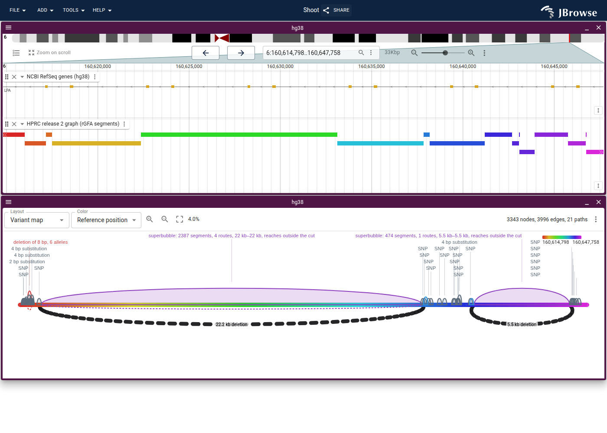

_The view's GBZ cut at the default 1 kb context: the array as two truncated
bubbles, now labelled as reaching outside the cut._

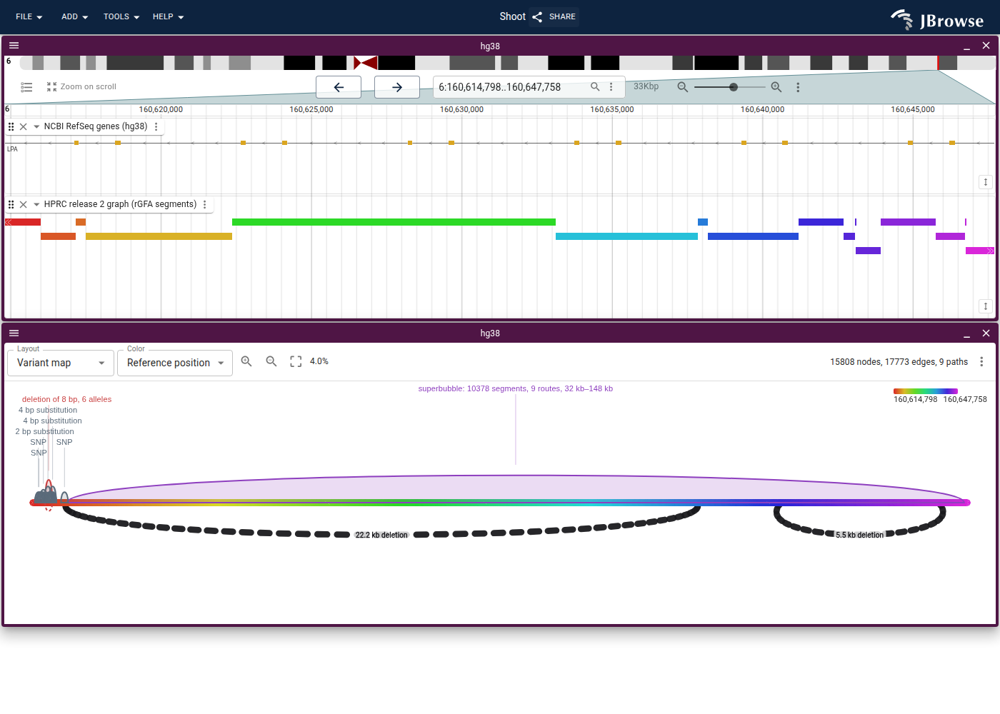

_The same track with `context: 200000`: one bubble, 9 routes, 32 kb to 148 kb,
the haplotypes' own lengths._

A derived bubble now says when this happened. A walk piece that enters the
bubble and ends before its other boundary is a route the cut did not keep, so
the bubble is marked partial, "reaches outside the cut", and its lengths read as
a floor. The remedy is a `context` on the track that covers the longest allele,
or the snarl extension on the kept-haplotype path upstream.

## Carriage, collapsed

The eight-haplotype KIV-2 GBZ cut carries walks, so every node's carriage is
countable in one pass (the reader survey confirms there is no coverage column;
walks are the source, and 30,000 steps for the window is microseconds). Merging
unbranching runs with identical carriage takes 15,808 nodes to 4,919, still far
past the legibility ceiling; the base-level graph is bushy with SNPs. Drawn
ordered with thickness by haplotype count it is a strip with the array as one
thick detour, which says less than the per-haplotype bars did. Carriage as
thickness is worth having as a colour-scheme-sized option for small cuts, but
the readout for a repeat array is the per-haplotype panel, not a node drawing.
`scripts/layout-lab/collapse.mjs` is the experiment.

## What did not help

- FMMM's force model, repulsion method and iteration counts, left at Bandage's
  values in every run; seeding dominated anything they could buy.
- OGDF Sugiyama, for the reasons above.
- Renaming nodes so Bandage's `linearLayout` sorts them in reference order. It
  works, but the component rotation then tips the line diagonal, so the engine
  needs the rotate flag either way.

## Review

A second model reviewed the lab code and every claim above against the sources,
running the timings again in one binary. It confirmed the orientation fit, the
layered layout's acyclicity and layer invariants (no duplicate positions, no
shared backbone layers, every edge left to right on eight graphs), the
legibility ceiling and the wasm sizes. It refuted the speed claim, found the
reserved-lane bug, and supplied the multilevel explanation and the four engine
integration points listed under experiment 2. Its notes are folded in above.

## Reproduce

`scripts/layout-lab/` holds the harness: `cut-hprc.ts` cuts a locus from the
hosted index with the adapter's hop rule, `one.mjs` runs any set of layout
variants on a GFA and writes PNGs, `ordered.mjs` is the layered prototype,
`engine.mjs` drives the committed wasm engine and holds the orientation fit,
`native/driver.cpp` runs FMMM with seeds against a native OGDF built by
`scripts/profile/build.sh`. `README.md` there has the commands.
