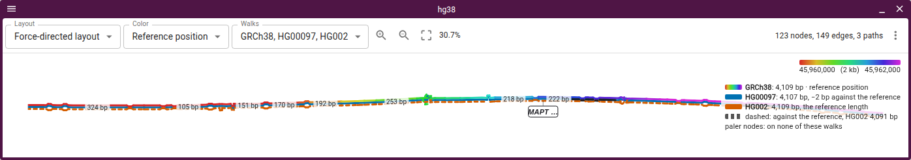
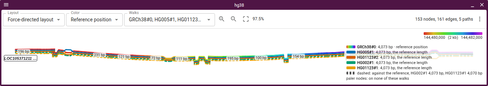

# Layouts

The plugin ships seven layouts:

- **Force-directed**: the graph's shape, from the OGDF FMMM engine in
  [Bandage](https://github.com/rrwick/Bandage), seeded along the reference to
  read left to right. The engine lays out unbranching runs, so a base-level cut
  of 15,000 nodes draws in a few seconds.
- **Ordered**: x is reference order, so every node gets room and a bubble reads
  as a lens. It scrolls sideways.
- **Anchored**: x is reference bp, one row per stable rank, aligned under a
  linear view.
- **Sample rows**: x is reference bp, one row per contributing assembly.
- **Walk rows**: x is each walk's own bp, one bar per haplotype, so a repeat
  expansion reads as bar length. Sequence shared with the reference takes the
  reference-position hue of the stretch the graph threads it through, and
  haplotype-only sequence is charcoal; under other colour schemes they are blue
  and purple. The Repeat picker tiles the bars by a repeat annotation's unit and
  marks the allele a genotyper called.
- **Tube map**: [sequenceTubeMap](https://github.com/vgteam/sequenceTubeMap)'s
  drawing, every path a coloured tube through boxed nodes, with columns in node
  order and node widths log-scaled.
- **Tube map on reference**: the same tubes with each column at the reference bp
  its node covers, so they line up with the tracks around them.

Ordered and Anchored need an rGFA or a reference path; Walk rows and Tube map
need W or P lines, and Tube map on reference needs both.

In a track of a linear view, a force-directed or ordered drawing has no bp axis
of its own. A strip along the top of the track draws each reference segment at
its bp, in the colour its node has in the graph, so under the reference-position
ramp a hue on the strip finds its node below. Hovering either one boxes the
node's reference span on the strip and draws a leader to the node; an allele's
span runs between its flanks. Hovering a bubble's name does the same for the
bubble's span. While the Walks picker lifts haplotypes, the reference segments
none of them visits fade on the strip as they do in the graph. A triangle at
either end of the strip says the graph draws reference past that edge of the
window. The track menu's **Reference strip at bp** turns the strip off.


## Tube maps

- Laid out by `@gmod/tubemap-core`, sequenceTubeMap's layout, from the P and W
  lines, reference first
- A reverse-strand walk runs through its boxes right to left
- On the reference axis each column boundary takes up to 24 px for its curves;
  inserted sequence covers no reference
- In a linear view's track the tubes squeeze to the track's height; drag it
  taller for wider tubes
- In a view of its own, the session's genes draw in rows above the tubes, mapped
  through the reference's boxes, so on the own axis an exon is as wide as the
  boxes that carry it. The fit leaves as many rows as genes overlap at one
  point, up to four. A linear view has them in their own track, at their bp, and
  draws none over the tubes
- On the own axis in a linear view, a band runs from each reference node's bp on
  the ruler down to its box, as the LD display ties its matrix columns to their
  variants. The wedges between bands are the curves and inserted sequence, which
  cover no reference. Hovering a band picks out its node, and a cut too long for
  the track fans out from the stretch of ruler on screen
- On the own axis a box is as wide as the log of its length (2 bp is 8 px, 100
  bp 56, 1 kb 84, 22 kb 121), so no box is to scale, and the legend says so. The
  ruler under the tubes treats every box alike: a bracket with a tick at each
  end, the box's length where it fits inside, and positions at box boundaries,
  the ends of what is on screen first. On the reference axis the boxes are to
  scale, so its ruler is one line with round positions, and in a linear view the
  view's own ruler is the axis
- A box's outline fades below 12 px wide, so a zoomed-out cut shows its tubes
- On the own axis the fit stops at 5 px tubes: a longer cut opens at its left
  end and you pan along it, as in sequenceTubeMap, or zoom out for the whole cut
- **Fold variants** folds every variant under a size into the reference, after
  svSTM
  ([van den Brandt et al., EuroVis 2025](https://doi.org/10.2312/evs.20251091)):
  the reference between two larger ones is one box, and each walk marks what it
  carries there as a tick on its tube at the variant's bp, which the legend
  names with the fold's size. A human window is mostly SNPs, so MICB's 22 kb cut
  goes from 475 columns to 34 under 3 bp and to one box under 50, where it reads
  as a SNP strip per haplotype. A repeat array keeps one box per distinct copy
  route. Off by default, and off while reads are shown, since they are placed by
  the segments a fold merges

### Reads

GAF reads draw under the haplotypes of a gbz-base track in both tube map
layouts. The adapter names the file, and a `.gz` one takes the `.tbi` beside it:

```json
{
  "type": "GbzBaseSyntenyAdapter",
  "uri": "graph.gbz.db",
  "reads": "reads.gaf.gz",
  "assemblyNames": ["hg38"]
}
```

`vg giraffe` aligns reads to the same GBZ, building its distance and minimizer
indexes on the first run; sorting, bgzipping and indexing the GAF lets each cut
fetch only the reads over its nodes:

```console
vg giraffe -Z graph.gbz -f reads.fq -o gaf > reads.gaf
vg gamsort -G reads.gaf | bgzip > reads.gaf.gz
tabix -p gaf reads.gaf.gz
```

- GAF from minigraph or GraphAligner works too. Step names have to be the cut's
  segment names: numeric ids, or `vg giraffe --named-coordinates` on a graph
  with renamed or chopped segments
- A tabix GAF index keys each read by its lowest and highest node id, so it
  needs numeric ids. Without an index (`"reads": "reads.gaf"`, or a gzipped file
  in `readsLocation`), the plugin reads the file whole, up to 50 MB
- Only gbz-base tracks take reads; an rGFA track, or a GFA file opened with
  **Add → Graph genome view**, has no reads input
- Up to 5000 reads a cut, sampled evenly past that; blues forward, reds reverse.
  Beside reads the haplotype tubes turn grey, as sequenceTubeMap draws them, so
  no tube shares a read's colour
- The cs tag's edits are drawn on the reads: substituted bases, `*` for an
  insertion, grey for a deletion, hidden when zoomed out. The legend names the
  strands and each kind of edit in view


Eight HPRC haplotypes over MICB's exons 2–4, as a track under the RefSeq genes
and as a view:


sequenceTubeMap's cactus test graph with NA12879's reads under its three paths,
zoomed in far enough to letter each read's mismatches. The paths are vg generic
paths, which the legend names by contig; a haplotype index beside the database
(`gbz-haplotype-index --from-db cactus.gbz.db cactus.haplotype-index.db`) is
what names the two that are not the reference:


## Bubbles

The plugin reads `gfatools bubble` output from `<prefix>.bubbles.bed.gz` beside
the rGFA index, which HPRC's hosted graph has and `scripts/build_rgfa_tabix.sh`
in jbrowse-components writes. For a GBZ cut, a pggb file or a popped bubble, the
plugin derives bubbles from the ordered layout's layering. With **Mark bubbles**
on, the node layouts draw each as a halo along its nodes, coloured by kind,
which the legend names. It is off by default, since at base level every SNP's
halo is a blob.


A bubble's label opens its nodes on their own, with a button back to the window.
The popped graph derives its own bubbles, so a superbubble opens level by level.
The KIV-2 array opens to 27 segments:


## Haplotype walks

A gbz-base cut carries the haplotypes' walks. A node draws thicker the more
walks carry it, as Bandage draws depth. Each route through a bubble carries a
label with its haplotypes and length, so the KIV-2 array reads as one copy count
per haplotype:


The Walks picker lifts any number of haplotypes out of the drawing. Each lifted
walk draws a lane of its own through the nodes it visits, the rest of the graph
fades, and a readout gives each walk's length against the reference. Where one
lifted walk visits a node and another does not, the second walk's lane is
missing there, which is where their routes part. The reference walk's lane comes
first, then the others in the order they were picked. Through the KIV-2 array
GRCh38 takes the rainbow, HG00097 blue and HG00133 vermillion; HG00097 carries
22 kb more than GRCh38, HG00133 116 kb more:


In a track, the reference strip shows what the lifted walks skip at its bp.
GSTM1 is deleted on six of the eight haplotypes; with HG00133 lifted, the 18 kb
it lacks fades on the strip under the RefSeq gene, and its lane takes the
shortcut past the faded loop:


### Colouring lifted walks

A lifted walk colours its lane by an encoding: a field, the quantity the walk
has at each node it visits, drawn through a scheme, the scale from that quantity
to a colour.

| Field                   | What the colour says                                                           |
| ----------------------- | ------------------------------------------------------------------------------ |
| One colour for the walk | which walk the lane is, and nothing else                                       |
| Progress along the walk | how far through its own length the walk is, pale at the start, deep at the end |
| Reference position      | where the node sits on the reference, charcoal off it                          |

The schemes are Okabe and Ito's blue, vermillion, bluish green, orange and
reddish purple, which stay apart under the common colour vision deficiencies,
and the rainbow, which is the reference-position ramp and goes with reference
position only. The reference walk takes reference position in the rainbow by
default, and each other walk one colour of its own, in that order. Progress
shows which way a walk runs round a loop. The **Walk** menu sets each lifted
walk's field and palette, and a session states them per walk, leaving out
whatever takes the default:

```json
"walkLayers": [
  { "walk": "GRCh38#0#chr6" },
  { "walk": "HG00133#1#CM090050.1", "color": { "field": "progress" } }
]
```

Which way a walk runs is a mark rather than a colour, so a lane's hue keeps
naming its walk. Where a lifted walk crosses the reference's nodes the other
way, its lane is dashed, and the readout names each such walk with the bp it
runs reversed. That is how a force drawing shows an inversion: both orientations
of an inverted haplotype visit the same nodes, so without the dashes the drawing
looks the same either way. HG002's first haplotype carries the H2 inversion at
MAPT, and HG00097's does not:



At the 1q21.1 inversion GRCh38 reads the minority orientation: 333 of 455 HPRC
haplotypes, CHM13 among them, run the other way. HG01123 carries one orientation
on each haplotype, so its two lanes sit side by side, one dashed:



The Walk menu's **Dash where it runs against the reference** turns the mark off
for one walk, and a session states it as `"reversedMark": false`.

Walk rows draw the same cut as one bar per haplotype. With the Repeat picker on
the curated VNTR track, each bar runs between the KIV-2 array's flanking
reference nodes and is tiled by its 5,548 bp kringle unit, so the copy number
reads off the bar: about 6 in GRCh38, 27 in HG00133. Purple is copies GRCh38
does not carry:


Under the reference-position ramp, a copy's hue is the reference copy the graph
threads it through. In a tandem array that is the aligner's pick among
near-identical copies: at KIV-2, 13 of the 32 threaded copies take the hue of a
reference copy of the other repeat type. To colour each copy by the unit it
actually is, load
[jbrowse-plugin-tandem-repeat](https://github.com/GMOD/jbrowse-plugin-tandem-repeat)
and right-click a VCF 4.5 `<CNV:TR>` record stating each allele's copies.

## Genes on the graph

The session's gene track draws exons as dark stretches along the backbone and
pins each gene's name under its midpoint. A tube map in a view of its own draws
genes in rows above the tubes instead, and one in a linear view leaves them to
the gene track (see Tube maps). In MHC class II, one 254-segment superbubble
covering the DRB block reads as HLA-DRB5's, and the indels after it as
HLA-DRB6's and HLA-DRB1's:


The view draws genes only on a backbone of the assembly it read them for. A
backbone names a sample by PanSN (`GRCh38#0#chr6`), never an assembly. A walk
names the cut's assembly where its sample or haplotype is that assembly's name,
a session alias, the prefix the graph track's `assemblyNameToPanSN` maps it to,
or a reference assembly's well-known sample (hg38 is GRCh38, hs1 is CHM13). A
path graph opens with x along that walk, else along the first one, which is the
walk a gbz-base cut follows: the adapter's `referenceSample`, the database's
only reference sample, or vg's generic `_gbwt_ref`. The graph track's config
puts that walk, like an rGFA's fixed backbone, on the cut's assembly, so it
takes the genes whatever its name. Once "Draw x along" picks another walk, the
genes stay only where that walk names their assembly. A sample-level name
(`HG002`) names no haplotype of a diploid, and a bare (`chr6`) or generic name
names none.
