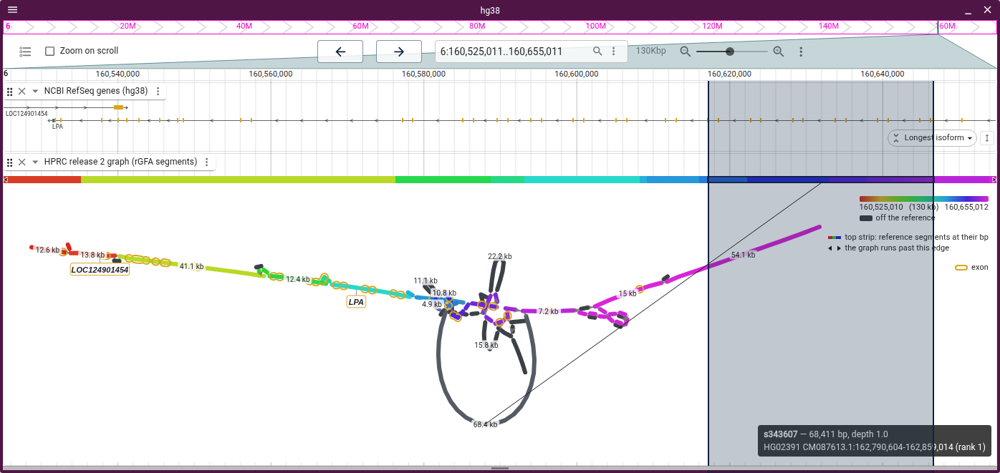
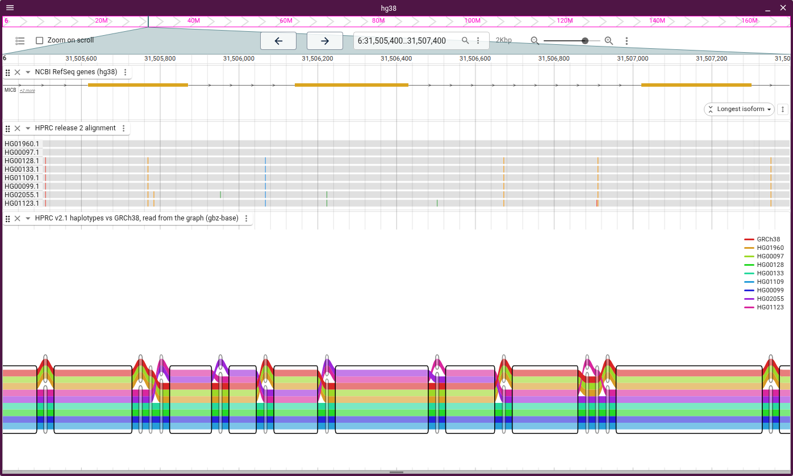
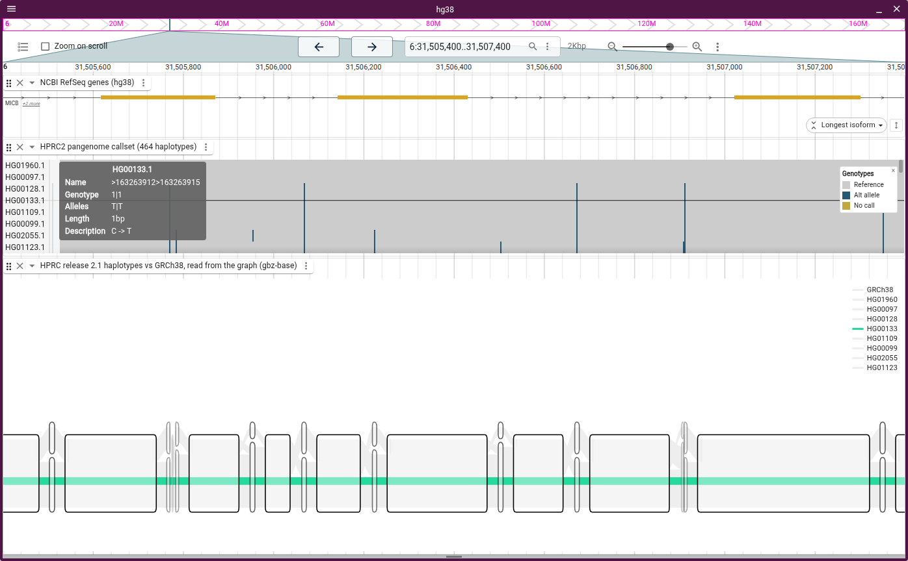
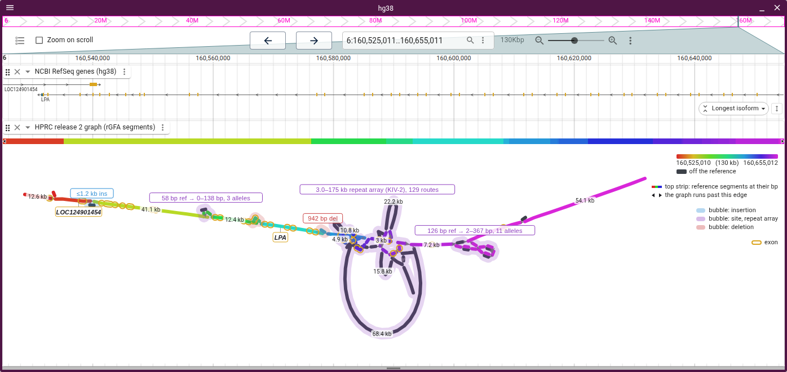
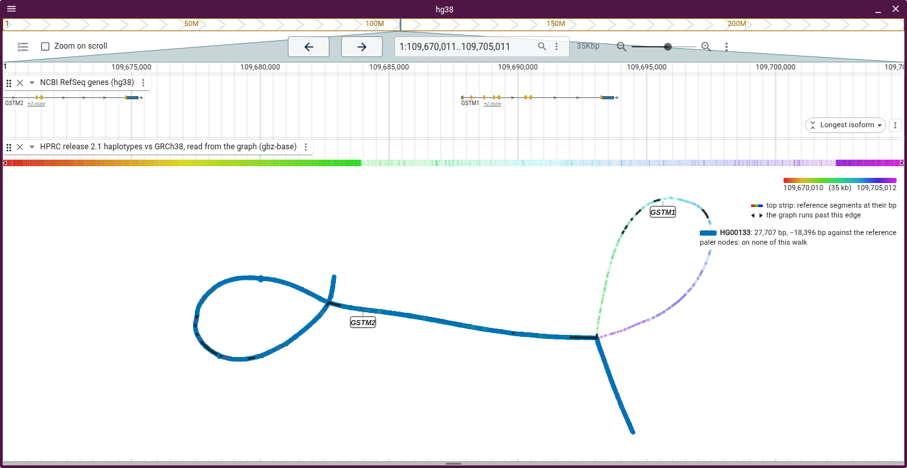
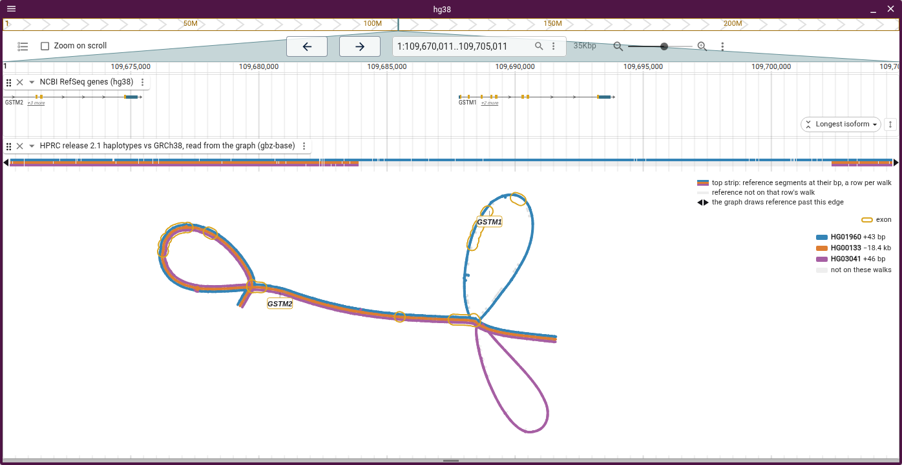
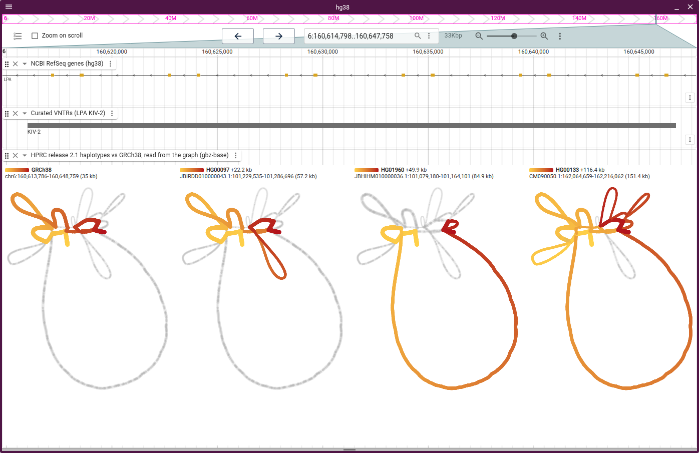

# Layouts

The plugin ships seven layouts:

- **Force-directed**: the graph's shape, from the OGDF FMMM engine in
  [Bandage](https://github.com/rrwick/Bandage), seeded along the reference to
  read left to right. The engine lays out unbranching runs, so a base-level cut
  of 15,000 nodes draws in a few seconds.
- **Ordered**: x is reference order, so every node gets room and a bubble reads
  as a lens. It scrolls sideways.
- **Anchored**: x is reference bp, one row per stable rank, aligned under a
  linear view.
- **Sample rows**: x is reference bp, one row per contributing assembly.
- **Walk rows**: x is each walk's own bp, one bar per haplotype, so a repeat
  expansion reads as bar length. A stretch on the reference's path takes the
  reference-position hue of the reference it runs through, and a stretch off it
  is charcoal; under other colour schemes they are blue and purple. Off the path
  is an alternative route through the graph, not sequence the reference lacks:
  at a duplication the graph may route a copy the reference has through nodes of
  its own. Each bar boxes its haplotype's own genes, read from the gene track of
  the session assembly its PanSN name (`HG00097#1`) names. The Repeat picker
  tiles the bars by a repeat annotation's unit and marks the allele a genotyper
  called.
- **Tube map**: [sequenceTubeMap](https://github.com/vgteam/sequenceTubeMap)'s
  drawing, every path a coloured tube through boxed nodes, with columns in node
  order and node widths log-scaled.
- **Tube map on reference**: the same tubes with each column at the reference bp
  its node covers, so they line up with the tracks around them.

Ordered and Anchored need an rGFA or a reference path; Walk rows and Tube map
need W or P lines, and Tube map on reference needs both.

A tube map's boxes are clear under Auto, since its tubes' hues are what tell the
paths apart. Pick a scheme under **Color** and each box takes the colour the
other layouts give its node: under **Reference position**, the hue of its bp on
the ramp the linear view's segments share, charcoal off the reference. The tubes
then step through greys, so no tube shares a box's hue.

In a track of a linear view, a force-directed or ordered drawing has no bp axis
of its own. A strip along the top of the track draws each reference segment at
its bp, in the colour its node has in the graph, so under the reference-position
ramp a hue on the strip finds its node below. The linear view's gridlines show
through it, so each segment reads as a feature at its bp, and while the segments
on screen average 12 px or more, touching ones alternate between two tiers, as a
feature track stacks features. A base-level cut, whose backbone splits at every
SNP, draws as one band. Hovering either one boxes the node's reference span on
the strip and draws a leader to the node; an allele's span runs between its
flanks. Hovering a bubble's name does the same for the bubble's span. While the
Walks picker lifts haplotypes, the strip gives each lifted walk a row in its
lane's colours, pale where that walk skips a reference segment, so a deletion is
a pale gap in one haplotype's row. A triangle at either end of the strip says
the graph draws reference past that edge of the window. The track menu's
**Show... › Show reference strip** turns the strip off.

Where does KIV-2's longest allele go on GRCh38? Hovering HG02391's 68 kb segment
boxes its span between its flanks on the strip, and the linear view bands the
same bp across the curated KIV-2 array:



## Tube maps

- Laid out by `@jbrowse/tubemap-core`, sequenceTubeMap's layout, from the P and
  W lines, reference first
- A reverse-strand walk runs through its boxes right to left
- On the reference axis each column boundary takes up to 24 px for its curves;
  inserted sequence covers no reference
- In a linear view's track the tubes squeeze to the track's height; drag it
  taller for wider tubes
- In a view of its own, the session's genes draw in rows above the tubes, mapped
  through the reference's boxes, so on the own axis an exon is as wide as the
  boxes that hold it. The fit leaves as many rows as genes overlap at one point,
  up to four. A linear view has them in their own track, at their bp, and draws
  none over the tubes
- On the own axis in a linear view, a band runs from each reference node's bp on
  the ruler down to its box, as the LD display ties its matrix columns to their
  variants. The wedges between bands are the curves and inserted sequence, which
  cover no reference. Hovering a band picks out its node, and a cut too long for
  the track fans out from the stretch of ruler on screen
- On the own axis a box is as wide as the log of its length (2 bp is 8 px, 100
  bp 56, 1 kb 84, 22 kb 121), so no box is to scale, and the legend says so. The
  ruler under the tubes treats every box alike: a bracket with a tick at each
  end, the box's length where it fits inside, and positions at box boundaries,
  the ends of what is on screen first. On the reference axis the boxes are to
  scale, so its ruler is one line with round positions, and in a linear view the
  view's own ruler is the axis
- A box's outline fades below 12 px wide, so a zoomed-out cut shows its tubes
- On the own axis the fit stops at 5 px tubes: a longer cut opens at its left
  end and you pan along it, as in sequenceTubeMap, or zoom out for the whole cut
- **Fold variants** folds every variant under a size into the reference, after
  svSTM
  ([van den Brandt et al., EuroVis 2025](https://doi.org/10.2312/evs.20251091)):
  the reference between two larger ones is one box, and each walk marks its own
  allele there as a tick on its tube at the variant's bp, which the legend names
  with the fold's size. A human window is mostly SNPs, so MICB's 22 kb cut goes
  from 475 columns to 34 under 3 bp and to one box under 50, where it reads as a
  SNP strip per haplotype. A repeat array keeps one box per distinct copy route.
  Off by default, and off while reads are shown, since they are placed by the
  segments a fold merges

### Reads

GAF reads draw under the haplotypes of a gbz-base track in both tube map
layouts. The adapter names the file, and a `.gz` one takes the `.tbi` beside it:

```json
{
  "type": "GbzBaseSyntenyAdapter",
  "uri": "graph.gbz.db",
  "reads": "reads.gaf.gz",
  "assemblyNames": ["hg38"]
}
```

`vg giraffe` aligns reads to the same GBZ, building its distance and minimizer
indexes on the first run; sorting, bgzipping and indexing the GAF lets each cut
fetch only the reads over its nodes:

```console
vg giraffe -Z graph.gbz -f reads.fq -o gaf > reads.gaf
vg gamsort -G reads.gaf | bgzip > reads.gaf.gz
tabix -p gaf reads.gaf.gz
```

- GAF from minigraph or GraphAligner works too. Step names have to be the cut's
  segment names: numeric ids, or `vg giraffe --named-coordinates` on a graph
  with renamed or chopped segments
- A tabix GAF index keys each read by its lowest and highest node id, so it
  needs numeric ids. Without an index (`"reads": "reads.gaf"`, or a gzipped file
  in `readsLocation`), the plugin reads the file whole, up to 50 MB
- Only gbz-base tracks take reads; an rGFA track, or a GFA file opened with
  **Add → Graph genome view**, has no reads input
- Up to 5000 reads a cut, sampled evenly past that; blues forward, reds reverse.
  Beside reads the haplotype tubes turn grey, as sequenceTubeMap draws them, so
  no tube shares a read's colour, and the boxes stay clear whatever **Color**
  says
- The cs tag's edits are drawn on the reads: substituted bases, `*` for an
  insertion, grey for a deletion, hidden when zoomed out. The legend names the
  strands and each kind of edit in view

Eight HPRC haplotypes over MICB's exons 2–4, one of the most polymorphic genes
in the genome, as tracks under the RefSeq genes. On the reference axis each
column sits at its bp, so the variant columns in an exon sit under that exon.
Between the two, HPRC's multiple alignment from the same Minigraph-Cactus build,
cut to the same eight haplotypes and ordered as the key lists them, marks a
mismatch in a row wherever its tube leaves GRCh38's route:



On the tube map's own axis the columns go in node order, and a band ties each
reference node back to its bp on the view's ruler, under the alignment's
mismatches at that bp:


Hovering a genotype cell of a callset lane in the same view lifts that
haplotype's walk: a tube map keeps its tube in colour and greys the rest, and
the layouts that draw nodes lift it as the Walks picker does. The row's name
picks the walk, a phased callset's `HG00133 HP0` or a MAF's `HG00133.1` naming
the graph's `HG00133#1`; a MAF row does it on JBrowse releases after
5.0.0-beta.10, whose MAF display publishes the row it is hovered on:



Opened as a view under the linear view, the cut draws MICB's exons above the
tubes, and hovering a box bands its bp in the linear view. Here it is GRCh38's
base at 31,505,769 in exon 2, which three of the nine walks take:


sequenceTubeMap's cactus test graph with NA12879's reads under its three paths,
zoomed in far enough to letter each read's mismatches. The paths are vg generic
paths, which the legend names by contig; a haplotype index beside the database
(`gbz-haplotype-index --from-db cactus.gbz.db cactus.haplotype-index.db`) is
what names the two that are not the reference:


## Bubbles

The plugin reads `gfatools bubble` output from `<prefix>.bubbles.bed.gz` beside
the rGFA index, which HPRC's hosted graph has and `scripts/build_rgfa_tabix.sh`
in jbrowse-components writes. For a GBZ cut, a pggb file or a popped bubble, the
plugin derives bubbles from the ordered layout's layering. With **Show... › Show
bubble halos** on, the node layouts draw each as a halo along its nodes,
coloured by kind, which the legend names. It is off by default, since at base
level every SNP's halo is a blob.

The HPRC bubbles track draws the same `gfatools bubble` records at their bp, so
each halo is a feature above it: the 3,018–174,966 bp record, 29 segments and up
to 129 paths, is the halo named "3.0–175 kb repeat array (KIV-2), 129 routes":



A bubble's label opens its nodes on their own, with a button back to the window.
The popped graph derives its own bubbles, so a superbubble opens level by level.
Opened in the track, the KIV-2 array keeps its strip, and its reference segments
sit at their bp under the curated KIV-2 annotation:


## Haplotype walks

A gbz-base cut includes the haplotypes' walks. A node draws thicker the more
walks visit it, as Bandage draws depth. Each route through a bubble has a label
with its haplotypes and length.

The Walks picker lifts haplotypes out of the drawing, and the rest of the graph
fades to grey. A tube map has no picker, since its tubes already are the walks.
Past a dozen walks the track menu lists only the lifted ones, and **Choose
walks...** searches the rest by name. A walk lifted alone shades light to dark
along itself, so it can be followed round a loop; its key is a short bar of that
gradient, with the stretch it runs over on the walk's own contig written under
it as `contig:start-end (length)`. At GSTM1, HG00133 runs cyan to navy past the
loop its 18 kb deletion skips. The synteny view under it reads the same track as
HG00133 aligned to GRCh38, and the deletion is the wedge pinched to a point on
HG00133's contig. HPRC's own wfmash alignment puts it in the same place, inside
the repeat that flanks GSTM1. Above the graph, six of the cut's eight haplotypes
break across GSTM1 in the multiple alignment, HG00133 among them:



Walks lifted together each take one flat colour, like the lines of a metro map,
and draw a lane each through the nodes they visit; a lane missing from a node is
a walk that does not go there. The reference is grey, so no hue means anything
but a haplotype.

At GSTM1, three haplotypes take three routes. HG01960 runs through GRCh38's
GSTM1 and HG00133 skips it. HG03041 runs round a loop of its own, 46 bp longer
than GRCh38's: a copy of GSTM1 that the graph never merged with GRCh38's. HPRC's
own wfmash alignment runs HG03041 straight through GRCh38's GSTM1, so the loop
is how the graph was built, not a deletion. 84 of HPRC's 463 haplotypes have
GSTM1 that way. Synteny read from the graph records such a copy as a deletion
beside an insertion of the same length, and the synteny lanes draw it as a gap
just like HG00133's. The multiple alignment from the same build does too: in the
lane above the graph, HG03041's row breaks across GSTM1 where HG00133's does.
Only the graph view tells the two apart.



The Walk menu's **Side by side** facets the pane, the way a grammar of graphics
facets a plot. **A panel per walk** draws the same layout once per lifted walk,
each panel with its walk alone on one shared scale, yellow where the walk starts
and red where it ends. Walks then compare by where they go rather than by which
lane is which colour. A panel's title is its key, and clicking it lifts that
walk alone. While a node is hovered, each walk's key gives where that node sits
on the walk's own contig, or says the walk does not visit it. Through the KIV-2
array, which the curated annotation above puts at GRCh38's 35 kb, each haplotype
takes its own loops: HG00097 adds one to GRCh38's (+22.2 kb), HG01960 skips most
of GRCh38's for the big teardrop (+49.9 kb), and HG00133 takes both (+116.4 kb):



The panels share one view, so a pan, zoom, drag or hover in one moves or marks
them all. As many go across as draws each panel largest, the way `facet_wrap`
picks its grid: four square drawings go two by two in a tall pane and four
across in a wide one. **Columns** in the Walk menu fixes the count. **A row per
sample, a column per haplotype** lays the same panels out as
`facet_grid(sample ~ haplotype)` would, so a sample's two haplotypes read across
one row. A track whose x the linear view places stacks its panels full width, so
each keeps the ruler's bp. A track too short for its panels grows to fit them.

A session states the walks and the facet, in the shape every JBrowse display's
`facet` takes: the field bare, or with `domain`, the walks or samples whose
panels come first, and `columns`, how many go across by walk:

```json
"walkLayers": [
  { "walk": "GRCh38#0#chr6" },
  { "walk": "HG00133#1#CM090050.1", "color": { "scheme": "purple" } }
],
"facet": { "field": "walk", "domain": ["HG00133#1#CM090050.1"], "columns": 2 }
```

### Colouring lifted walks

A lifted walk colours its lane by an encoding: a field, the quantity the walk
has at each node it visits, drawn through a scheme, the scale from that quantity
to a colour. The **Walk** menu sets both per walk, overriding the defaults
above.

| Field                   | What the colour says                                                            |
| ----------------------- | ------------------------------------------------------------------------------- |
| Progress along the walk | how far through its own length the walk is, light at the start, dark at the end |
| One colour for the walk | which walk the lane is, and nothing else                                        |
| Reference position      | where the node sits on the reference, charcoal off it                           |

Each scheme runs from a light colour to a dark one of another hue, and no two
share a stretch of the colour wheel: grey to black for the reference, then cyan
to navy, yellow to red, pink to plum and lime to forest, in the order walks are
picked. A reader with red-green colour blindness sees only a blue to yellow
axis, so the first two stay apart for every reader. The rainbow is the
reference-position ramp and goes with reference position only; while walks are
lifted it appears nowhere else, and a track's reference strip takes the lifted
walks' lane colours, a row each.

A walk that crosses the reference's nodes the other way runs the other way along
them, and its key gives the bp it runs reversed. Both orientations of an
inverted haplotype visit the same nodes, so side by side is how a force drawing
shows an inversion: at MAPT, HG002's first haplotype has the H2 inversion and
runs red to yellow where GRCh38 runs yellow to red.

**Export › Save SVG** in the track menu saves the drawing, its walks' keys and
panels as a vector figure. The same renderer makes figures from a JSON spec with
no browser; see
[bandage-core's figures.md](https://github.com/GMOD/bandage-core/blob/main/docs/figures.md).

While walks are lifted, node lengths are not labelled, since they would sit on
the lanes.

Walk rows draw the same cut as one bar per haplotype. With the Repeat picker on
the curated VNTR track, each bar runs between the KIV-2 array's flanking
reference nodes and is tiled by its 5,548 bp kringle unit, so the copy number
reads off the bar: about 6 in GRCh38, 27 in HG00133. Purple is copies off
GRCh38's path, which at KIV-2 is most of a haplotype's extra copies. GRCh38's
six units are the six LPA exon pairs the gene track draws over the curated
array, one pair per kringle:


Under the reference-position ramp, a copy's hue is the reference copy the graph
threads it through. In a tandem array that is the aligner's pick among
near-identical copies: at KIV-2, 13 of the 32 threaded copies take the hue of a
reference copy of the other repeat type. To colour each copy by the unit it
actually is, load
[jbrowse-plugin-tandem-repeat](https://github.com/GMOD/jbrowse-plugin-tandem-repeat)
and right-click a VCF 4.5 `<CNV:TR>` record stating each allele's copies.

Under the ramp, walk rows draw a stretch off the reference's path charcoal, as
the node layouts draw a node of rank > 0, while a node with no reference
position at all draws grey. Matching the two either way fails: grey bars would
sit too near `OUTSIDE_CUT`, the light grey of a stretch outside the cut, and
charcoal unplaced nodes would merge with rank > 0 ones. Either change would also
recolour published figures.

KIV-2's charcoal is mostly shared sequence: in a cut of GRCh38 and eight HPRC
haplotypes, five carry one 68.7 kb block, and no row carries more than 5.7 kb
alone. Measurements ruled out two ways to colour it: 92–99% of its 31-mers hit
several GRCh38 copies, so k-mers can't place it on the reference, and grey by
how many walks carry a node stripes at every SNP.

Purple can mislead at a duplication. In the HPRC amylase cut, HG00133#1 has
GRCh38's structure, three AMY1 copies in the same order, and aligns to it
colinearly at 99.9% identity, yet 75 kb of its bar is purple, because the graph
routes its middle copies through nodes off GRCh38's path. Count copies from the
genes on each bar: in the HPRC config every release 2 haplotype is an assembly
with its CAT annotation, so each bar boxes its own AMY1 copies under CAT's
names. A gene track on the linear view above stays in reference coordinates,
which line up with the reference row only.

Right-click a bar to open that haplotype's span in a linear view, on its own
assembly with its gene track.

## Genes on the graph

The session's gene track draws each exon as a goldenrod outline, the gene
track's CDS colour, around the stretch of node that carries it, and pins each
gene's name under its midpoint. The nodes that carry a gene are the ones on its
sequence: the backbone, and a coarse tier's bubble nodes, each of which stands
for a span of the reference. The outline clears the node, and any lifted lanes
on it, so the colour inside stays the node's own. A name never covers a node its
gene does not lie on; it moves a row or is left off. A gene only partly inside
the cut says how much: `LPA · 35 of 132.8 kb`. A tube map in a view of its own
draws genes in rows above the tubes instead, and one in a linear view leaves
them to the gene track (see Tube maps).

Where the linear view shows the gene track as a lane, the graph names only what
that lane draws, so a lane filtered to `type == 'gene'` keeps mobile elements
and repeats off the graph as well. A record spanning a whole sequence, such as
the `region` RefSeq opens each molecule with, gets no name, and neither does one
with no `gene_name`, `Name`, `gene` or `gene_id` of its own, whose ID only
restates where it is.

In MHC class II the gene track's HLA-DRB5, HLA-DRB6 and HLA-DRB1 sit over their
exons on the graph's backbone. HLA-DR haplotypes differ in which DRB genes they
have, and the longest allele off the reference is HG01071's own 46.9 kb.
Hovering it shows where it goes: in place of 173 bp of GRCh38, between HLA-DRB5
and HLA-DRB6:


The view draws genes only on a backbone of the assembly it read them for. A
backbone names a sample by PanSN (`GRCh38#0#chr6`), never an assembly. A walk
names the cut's assembly where its sample or haplotype is that assembly's name,
a session alias, the prefix the graph track's `assemblyNameToPanSN` maps it to,
or a reference assembly's well-known sample (hg38 is GRCh38, hs1 is CHM13). A
path graph opens with x along that walk, else along the first one, which is the
walk a gbz-base cut follows: the adapter's `referenceSample`, the database's
only reference sample, or vg's generic `_gbwt_ref`. The graph track's config
puts that walk, like an rGFA's fixed backbone, on the cut's assembly, so it
takes the genes whatever its name. Once "Draw x along" picks another walk, the
genes stay only where that walk names their assembly. A sample-level name
(`HG002`) names no haplotype of a diploid, and a bare (`chr6`) or generic name
names none.
