# Layouts

The plugin ships eight layouts:

- **Force-directed**: the graph's shape, from the OGDF FMMM engine in
  [Bandage](https://github.com/rrwick/Bandage), seeded along the reference to
  read left to right. The engine lays out unbranching runs, so a base-level cut
  of 15,000 nodes draws in a few seconds.
- **Variant map**: the reference as a line with one typed glyph per bubble.
  Clicking a glyph opens that bubble's graph.
- **Ordered**: x is reference order, so every node gets room and a bubble reads
  as a lens. It scrolls sideways.
- **Anchored**: x is reference bp, one row per stable rank, aligned under a
  linear view.
- **Sample rows**: x is reference bp, one row per contributing assembly.
- **Walk rows**: x is each walk's own bp, one bar per haplotype, so a repeat
  expansion reads as bar length. Sequence shared with the reference takes the
  reference-position hue of the stretch the graph threads it through, and
  haplotype-only sequence is charcoal; under other colour schemes they are blue
  and purple. The Repeat picker tiles the bars by a repeat annotation's unit and
  marks the allele a genotyper called. A VCF 4.5 `<CNV:TR>` record stating each
  allele's repeat sequences paints every copy by its unit instead.
- **Tube map**: [sequenceTubeMap](https://github.com/vgteam/sequenceTubeMap)'s
  drawing, every path a coloured tube through boxed nodes, with columns in node
  order and node widths log-scaled.
- **Tube map on reference**: the same tubes with each column at the reference bp
  its node covers, so they line up with the tracks around them.

Variant map, Ordered and Anchored need an rGFA or a reference path; Walk rows
and Tube map need W or P lines, and Tube map on reference needs both.

## Tube maps

- Laid out by `@gmod/tubemap-core`, sequenceTubeMap's layout, from the P and W
  lines, reference first
- A reverse-strand walk runs through its boxes right to left
- On the reference axis each column boundary takes up to 24 px for its curves;
  inserted sequence covers no reference
- In a linear view's track the tubes squeeze to the track's height; drag it
  taller for wider tubes
- In a view of its own, the session's genes draw in rows above the tubes, mapped
  through the reference's boxes, so on the own axis an exon is as wide as the
  boxes that carry it. The fit leaves as many rows as genes overlap at one
  point, up to four. A linear view has them in their own track, at their bp, and
  draws none over the tubes
- On the own axis in a linear view, a band runs from each reference node's bp on
  the ruler down to its box, as the LD display ties its matrix columns to their
  variants. The wedges between bands are the curves and inserted sequence, which
  cover no reference. Hovering a band picks out its node, and a cut too long for
  the track fans out from the stretch of ruler on screen
- Outside a linear view a reference ruler runs under the tubes. On the own axis
  a long box's log width squeezes its bp, so its stretch of ruler zigzags,
  carries no ticks, and shows the box's length where the label fits
- A box's outline fades below 12 px wide, so a zoomed-out cut shows its tubes
- On the own axis the fit stops at 5 px tubes: a longer cut opens at its left
  end and you pan along it, as in sequenceTubeMap, or zoom out for the whole cut

### Reads

GAF reads draw under the haplotypes of a gbz-base track in both tube map
layouts. The adapter names the file:

```json
{
  "type": "GbzBaseSyntenyAdapter",
  "uri": "graph.gbz.db",
  "reads": "reads.gaf",
  "assemblyNames": ["hg38"]
}
```

`vg giraffe` aligns reads to the same GBZ, building its distance and minimizer
indexes on the first run:

```console
vg giraffe -Z graph.gbz -f reads.fq -o gaf > reads.gaf
```

- GAF from minigraph or GraphAligner works too. Step names have to be the cut's
  segment names: numeric ids, or `vg giraffe --named-coordinates` on a graph
  with renamed or chopped segments
- The plugin reads the file whole, plain or gzipped, up to 50 MB. A gzipped GAF
  goes in `"readsLocation": { "uri": "reads.gaf.gz" }`: the `reads` shorthand
  gives a `.gz` a `tabix -p gaf` index, which `@gmod/tabix` 3.8.3 can't read
- Only gbz-base tracks take reads; an rGFA track, or a GFA file opened with
  **Add → Graph genome view**, has no reads input
- Up to 5000 reads a cut, sampled evenly past that; blues forward, reds reverse
- The cs tag's edits are drawn on the reads: substituted bases, `*` for an
  insertion, grey for a deletion, hidden when zoomed out

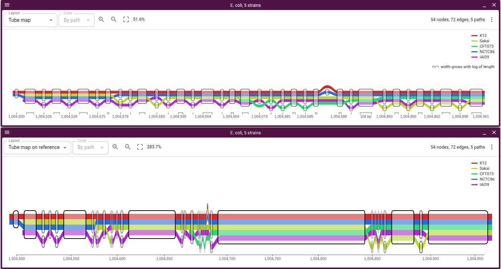

Eight HPRC haplotypes over MICB's exons 2–4, as a track under the RefSeq genes
and as a view:

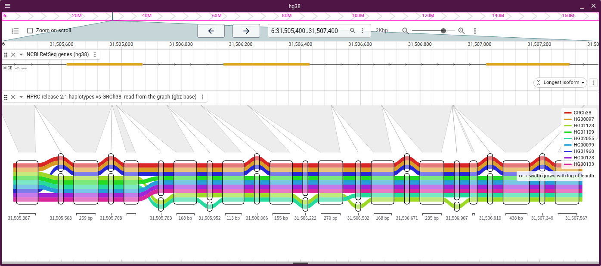

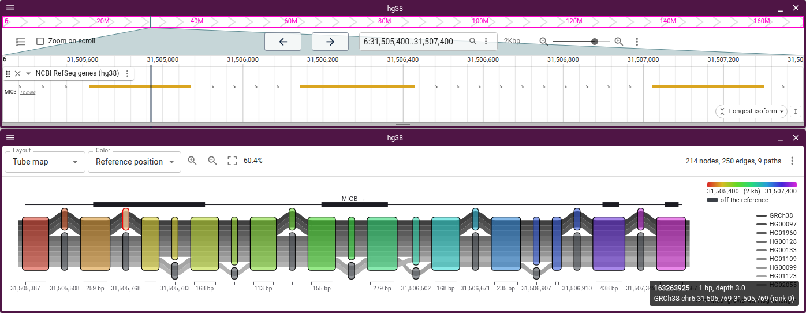

sequenceTubeMap's cactus test graph with NA12879's reads under its three
haplotypes, zoomed in far enough to letter each read's mismatches:

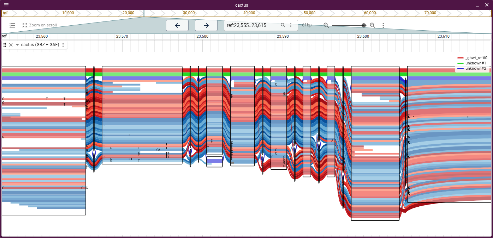

## Bubbles

The plugin reads `gfatools bubble` output from `<prefix>.bubbles.bed.gz` beside
the rGFA index, which HPRC's hosted graph has and `scripts/build_rgfa_tabix.sh`
in jbrowse-components writes. For a GBZ cut, a pggb file or a popped bubble, the
plugin derives bubbles from the ordered layout's layering. Node layouts draw
bubbles as halos, and the variant map draws them as glyphs.

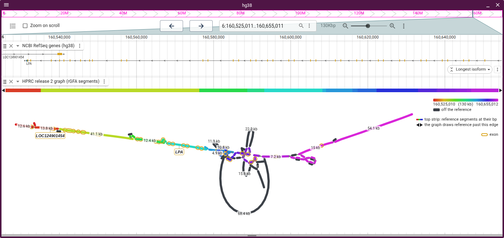

A bubble's label opens its nodes on their own, with a button back to the window.
The popped graph derives its own bubbles, so a superbubble opens level by level.
The KIV-2 array opens to 27 segments:

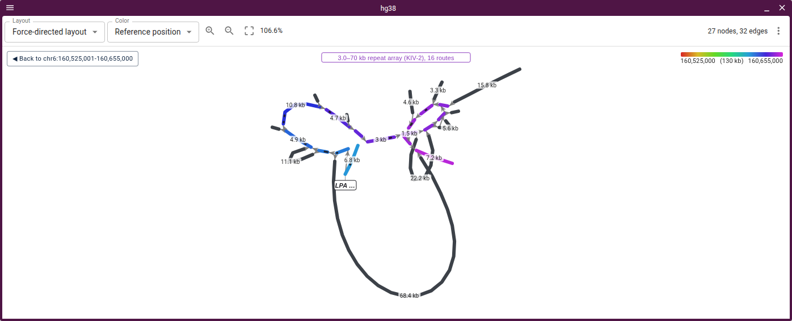

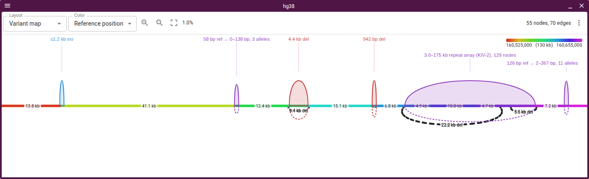

## Haplotype walks

A gbz-base cut carries the haplotypes' walks. A node draws thicker the more
walks carry it, as Bandage draws depth. Each route through a bubble carries a
label with its haplotypes and length, so the KIV-2 array reads as one copy count
per haplotype:

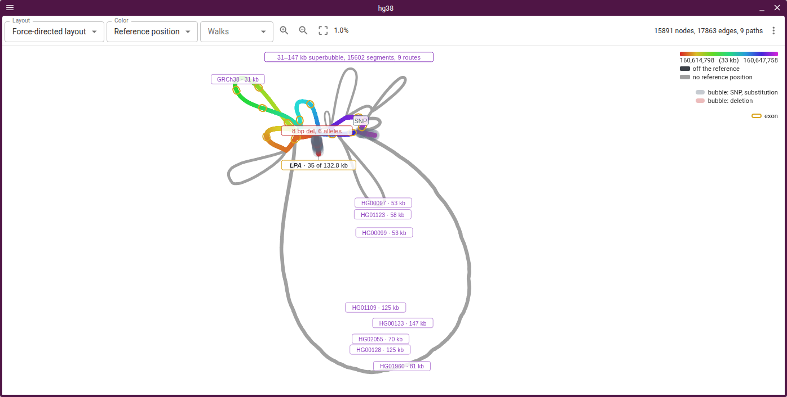

The Walk picker lifts one haplotype out: its route keeps its ink, the rest
fades, and a readout gives its length against the reference. HG00133 carries 116
kb more than GRCh38 through the array:

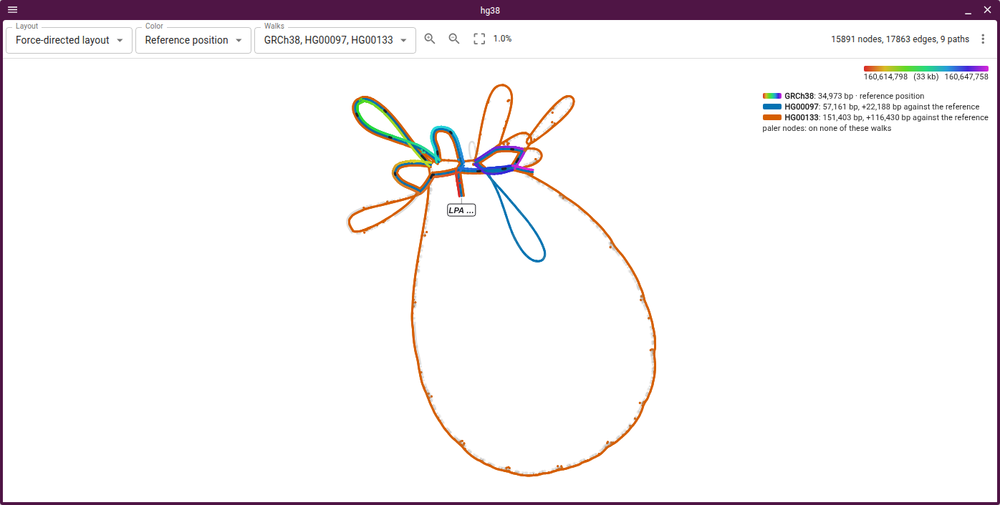

Walk rows draw the same cut as one bar per haplotype. With the Repeat picker on
the KIV-2 copies track, a VCF 4.5 `<CNV:TR>` record, each copy takes the colour
of its unit and the copy number reads off directly: 6 in GRCh38, 27 in HG00133.
KIV-2 copies come in two units about 2.3% apart, the two repeat types long-read
studies of LPA report. Unit 2 opens five of the eight arrays and sits fourth in
GRCh38's:

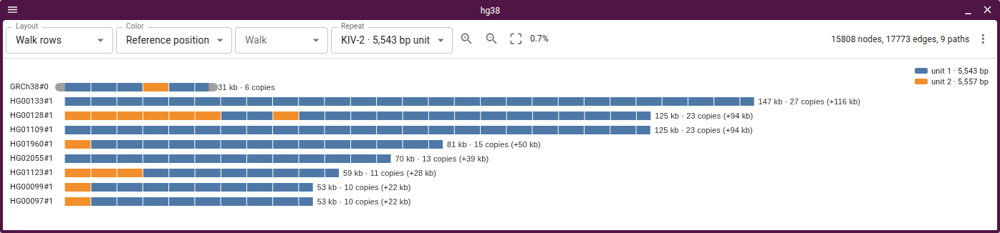

`scripts/tandem-repeat-vcf.mjs` wrote that record from the graph cut. It splits
each walk into copies where the reference array's first 24 bases recur, groups
copies within 1% of each other into a unit, and writes one repeat sequence per
run of a unit, with every copy's length in `RUB`. The record's phased `GT` puts
each allele on its PanSN haplotype, so a walk takes its own allele even beside a
haplotype of the same length. Output from a repeat finder draws the same way
once it is written in those fields.

Under the reference-position ramp without such a record, a copy's hue is the
reference copy the graph threads it through. In a tandem array that is the
aligner's pick among near-identical copies: at KIV-2, 13 of the 32 threaded
copies take the hue of a reference copy of the other unit.

## Genes on the graph

The session's gene track draws exons as dark stretches along the backbone and
pins each gene's name under its midpoint. A tube map in a view of its own draws
genes in rows above the tubes instead, and one in a linear view leaves them to
the gene track (see Tube maps). In MHC class II, one 254-segment superbubble
covering the DRB block reads as HLA-DRB5's, and the indels after it as
HLA-DRB6's and HLA-DRB1's:

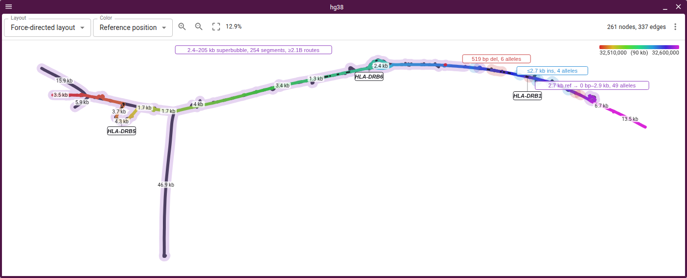

The view draws genes only on a backbone of the assembly it read them for. A
backbone names a sample by PanSN (`GRCh38#0#chr6`), never an assembly, so the
view binds it to the cut's assembly by that assembly's name, a session alias,
the prefix the graph track's `assemblyNameToPanSN` maps it to, or a reference
assembly's well-known sample (hg38 is GRCh38, hs1 is CHM13). A backbone of bare
contig names (`chr6`) names no sample, so it takes the assembly the track's
config puts the graph on: always for an rGFA, whose backbone is fixed, and for a
path graph only along the path it loaded with. Drawing x along another walk
hides the genes until x goes back.
